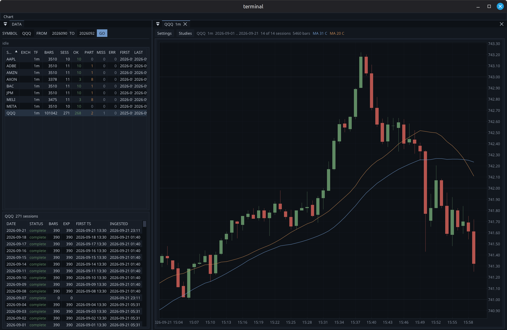
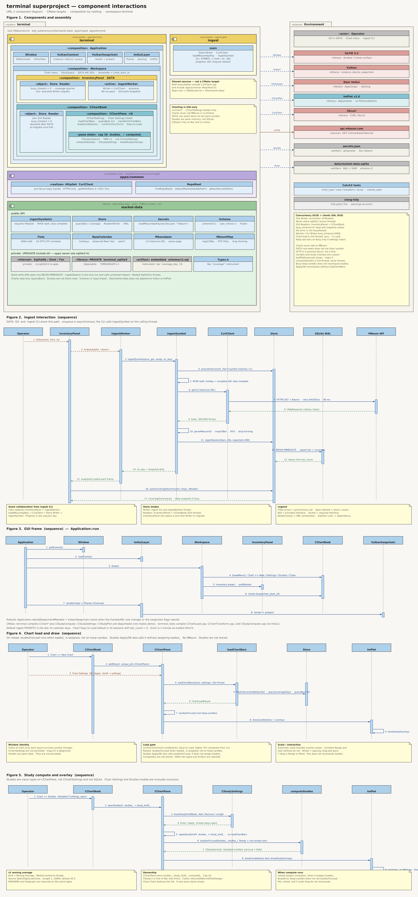

# terminal

Desktop financial terminal. It stores 1-minute US equity OHLCV in local SQLite, ingests from MBoum, lists coverage in a DATA panel, and charts candlesticks (1m, 5m, 15m, 1h, 1d) with overlay studies.



## Setup

Needs CMake 4.0+, a C++20 compiler, Vulkan (SDK and working drivers), GLFW 3.3, libcurl, and clang-tidy. clang-tidy is on by default; pass `-DTERMINAL_ENABLE_CLANG_TIDY=OFF` to skip it.

Debian/Ubuntu:

```
sudo apt install g++ ninja-build libglfw3-dev libvulkan-dev libcurl4-openssl-dev clang-tidy
```

Install CMake 4.0+ if the distro package is older.

```
cmake -S . -B build -G Ninja
cmake --build build
./build/terminal
```

Ingest needs a MBoum key at the repo root (gitignored):

```
{"mboum": "YOUR_KEY"}
```

Bars land in `data/market-data.sqlite`. Pull them from DATA (SYMBOL / FROM / TO / GO) or `./build/ingest AAPL`. Default range is the last 14 New York session dates.

First-party code is [PolyForm Noncommercial 1.0.0](LICENSE.md).


