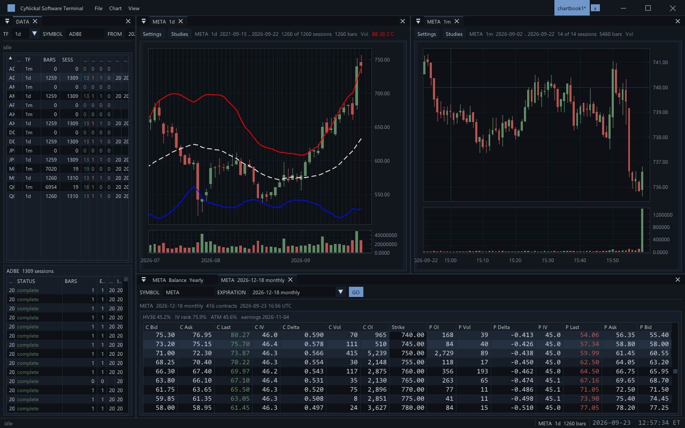
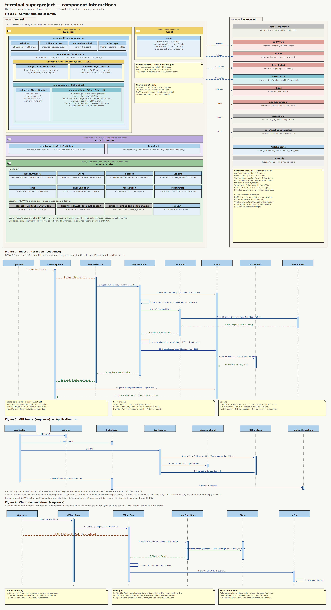

# terminal

Desktop financial terminal. It stores 1-minute and daily US equity OHLCV, financial statements, option chains, portfolios, and trade ledgers in local SQLite, ingests from MBoum, and charts, analyzes, and backtests from that store. Agents do research against the same store through a read-only query tool.



## Features

### Market data

- One SQLite store, `data/market-data.sqlite`, with a versioned schema (v6). It holds bars, splits, coverage, statements, option chains, portfolios, ledgers, and backtest runs.
- 1-minute regular-hours bars and daily bars. Intraday periods above 1m are built from 1m bars, in buckets anchored at the 09:30 ET open.
- Split adjustment on read. Stored prices stay as traded.
- NYSE session calendar and `America/New_York` session dates, including DST.
- Per-session coverage: `complete`, `partial`, `missing`, or `error`, with bar counts, so a gap is never mistaken for a quiet market.
- Instrument identity by FIGI. Every symbol is confirmed with OpenFIGI before it is written, and ticker renames and delistings are tracked as listing history.
- `ingest` command-line tool:
  - `ingest AAPL` or `ingest --timeframe 1d --from YYYYMMDD --to YYYYMMDD AAPL MSFT` downloads bars.
  - `ingest --verify [--all]` re-checks stored tickers and applies renames and delistings.
  - `ingest --delist SYMBOL` closes a listing by hand.

### Terminal (GUI)

A Vulkan and Dear ImGui desktop app with a custom title bar, dockable windows, and a status rail.

- **Chartbooks.** A chartbook is a saved layout of charts and panels. You can create, open, save, save as, save all, and close chartbooks, and choose which ones open at startup. Each panel's inputs are saved with its chartbook.
- **DATA.** Lists stored instruments and their coverage. Its toolbar (TF / SYMBOL / FROM / TO / GO) queues downloads.
- **Charts.**
  - Candlesticks at 1m, 5m, 15m, 1h, and 1d, with a hover readout.
  - Type a symbol or period and press Enter to change the chart. A symbol that is not stored is downloaded first.
  - Keyboard zoom and scroll (arrows, Home, End), Chart Settings (F5), and Studies (F6).
  - Studies: moving average, Bollinger Bands, N-bar percent change, and volume. Each study has its own settings and scale.
  - Symbol link groups #1–#4 change the symbol of every linked chart at once.
  - **Show Trades** draws a ledger's buys and sells on the chart, with a tooltip for each fill.
- **FINANCIALS.** A spreadsheet of income statement, balance sheet, or cash flow, annual or quarterly, for the last four periods.
- **OPTIONS CHAIN.** Calls left of the strike and puts right. The Columns menu picks which fields are shown.
- **PORTFOLIO.** A hand-edited book of hypothetical holdings: shares, options, and cash. Each line shows value and one-day historical VaR and CVaR. Share risk comes from daily closes, and option risk from delta.
- **PAYOFF WIZARD.** Expiration payoff graph for a multi-leg option position. Legs come from the stored chain or are typed by hand. Recipes: long or short call or put, covered call, protective put, collar, debit and credit spreads, strangle, butterfly, iron butterfly, and iron condor.
- **LEDGER.** An account made of fills and cash flows. Positions, round trips, and P&L are matched first-in first-out. Splits and the ×100 option multiplier are applied. Tabs show Positions, Closed, Fills, and Cash. On a manual ledger you enter fills and cash yourself.
- **STATISTICS.** For any ledger, manual or backtest:
  - Returns: net profit, total return, CAGR, a buy-and-hold benchmark, and exposure.
  - Risk: volatility, Sharpe, Sortino, Calmar, maximum drawdown and its length, and VaR/CVaR.
  - Trades: win rate, profit factor, payoff ratio, expectancy, streaks, and holding time.
  - Charts: time-weighted return against the benchmark, drawdown, and P&L per trade.
- **BACKTEST.** Runs a registered C++ strategy on stored bars and records the result as a ledger, which you can open in STATISTICS, LEDGER, or on a chart.
  - Strategies: MA crossover, Bollinger mean reversion, and N-bar momentum. They call the same study code the charts draw.
  - Settings: sizing (fixed shares, fixed notional, or a percent of equity), commission, slippage, stop-loss, take-profit, flat at each session end, and close at the end of the run.
  - Orders fill at the next bar's open. A test checks that no strategy uses future bars.
  - Missing bars in the run's range are downloaded before the run.
- **Refresh.** Ctrl+R refetches the focused panel's data. Each panel shows when its data was received.

## Setup

Needs CMake 4.0+, a C++20 compiler, Vulkan (SDK and working drivers), GLFW 3.3, libcurl, and clang-tidy. clang-tidy is on by default; pass `-DTERMINAL_ENABLE_CLANG_TIDY=OFF` to skip it.

Debian/Ubuntu:

```
sudo apt install g++ ninja-build libglfw3-dev libvulkan-dev libcurl4-openssl-dev clang-tidy
```

Install CMake 4.0+ if the distro package is older.

```
cmake -S . -B build -G Ninja
cmake --build build
./build/terminal
```

Ingest needs a MBoum key at the repo root (gitignored):

```
{"mboum": "YOUR_KEY"}
```

Bars land in `data/market-data.sqlite`. Pull them from DATA (TF / SYMBOL / FROM / TO / GO) or `./build/ingest AAPL` / `./build/ingest --timeframe 1d AAPL`. Default 1m range is the last 14 New York session dates; daily defaults to five years.

Agents and scripts read the store through [`agent-data/mdq.py`](agent-data/README.md) (read-only, split-adjusted, NYSE-calendar aware) instead of raw SQL.

On a focused chart, type a symbol or a bar period and press Enter (`QQQ`, `15m`, `1h`, `1d`). A symbol that is not in the database is downloaded for that chart's days-to-load window.

First-party code is [PolyForm Noncommercial 1.0.0](LICENSE.md).


