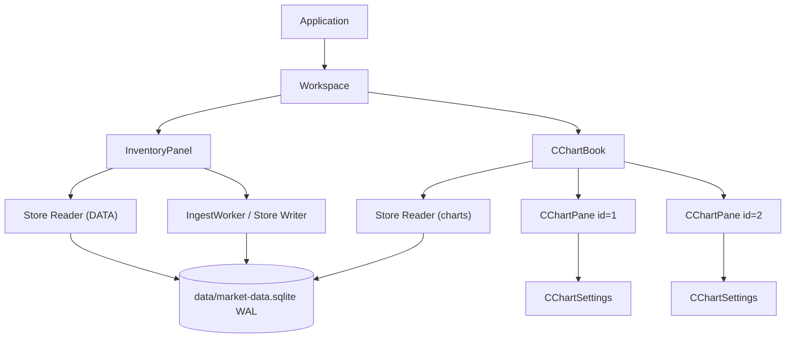
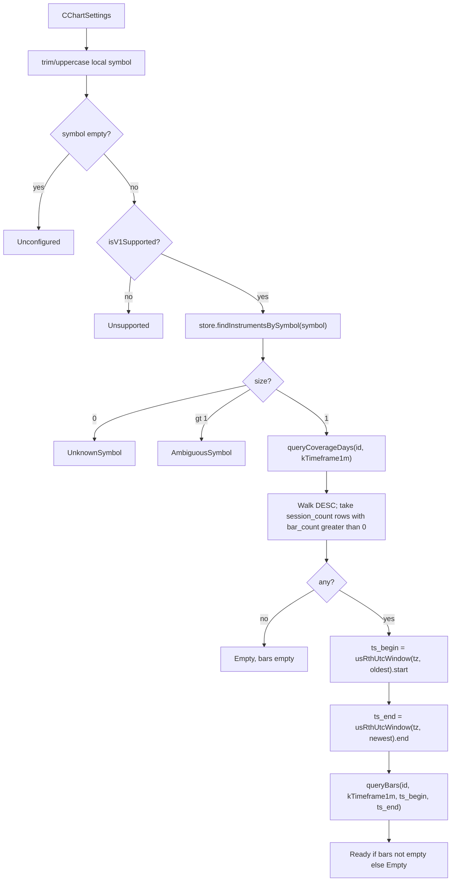

# Modular Chart Panes (`CChartPane` / `CChartSettings` / `CChartBook`)

| Field | Value |
|---|---|
| Author | terminal |
| Date | 2026-09-20 (revised) |
| Status | Draft |
| Audience | First-party C++ in `apps/terminal/` and `libs/market-data` |
| Related | `docs/market-data-store.md` (Store / `queryBars` / coverage), `docs/design.md` (visual tokens only), `deps/implot/` (vendored ImPlot v1.0) |

This is the **base design** for terminal charting. Implement from this document without guessing types or Store calls. Later PRs (other timeframes, bar types, studies, pan/zoom) must extend these types, not replace them.

Sierra Chart Chart Settings is **inspiration**, not a clone. v1 behavior specified here is terminal’s. Where Sierra details were not verified, they are not claimed.

---

## Overview

The terminal is an ImGui dock workspace (`Workspace`) with a left **DATA** inventory panel. There is no chart surface today. Dummy MONITOR/CHART/DETAIL/LOG windows were removed. Market data already lives in SQLite via `terminal::Store`; ingest is the DATA panel / `IngestWorker` path.

This design adds a **chartbook** of independent chart panes:

- `CChartSettings` — per-pane configuration (symbol, bar period, bar type, data limiter), Sierra-style.
- `CChartPane` — one dockable ImGui chart surface that owns settings, a bar snapshot, and a settings popup.
- `CChartBook` — container owned by `Workspace` that creates, focuses, closes, and draws panes.

v1 renders **1-minute candlestick bars only**, loaded with `Store::queryBars` over a **Days to Load** window of NYSE sessions. Period, bar type, and alternate limiters exist on `CChartSettings` so the type shape does not change later, but unsupported combinations are locked in the UI and rejected on apply.

Charts never talk to MBoum. They only read the existing Store.

---

## Background & Motivation

### Current terminal

| Piece | Location | What it does today |
|---|---|---|
| App loop | `apps/terminal/src/terminal/Application.{h,cpp}` | Owns `Workspace workspace_`. `run()`: poll → `workspace_.draw()` → render. |
| Dock host | `apps/terminal/src/ui/Workspace.{h,cpp}` | Fullscreen `WorkspaceDock` on `Theme::kCanvas`. First-run `DockBuilder` split: DATA left 30%, remainder empty. Owns `InventoryPanel`. No menu bar. |
| DATA | `apps/terminal/src/ui/InventoryPanel.{h,cpp}` | GUI `Store(path, StoreMode::Reader)` after a one-shot Writer migrate. Sortable `queryCoverageSummaries(kTimeframe1m)`; row select → `queryCoverageDays`. SYMBOL/FROM/TO + GO → `IngestWorker`. Default FROM/TO = **today minus 14 calendar days** in `America/New_York` (weekends included in the typed range; ingest skips Sat/Sun). Reader `busy_timeout=0`: keep last snapshot unless the error is not busy. `refreshSummaries` / `refreshDays` only search `ex.what()` for `"busy"`; SQLite’s `SQLITE_BUSY` errmsg is actually `"database is locked"` (`SqliteStmt::stepRow` → `sqlite3_step: ` + `sqlite3_errmsg`). Charts must match **both** (see D10). |
| Ingest | `apps/terminal/src/data/IngestWorker.{h,cpp}` | Background Writer + shared `apps/common/CurlClient`. MBoum 1-minute RTH. |
| Theme | `apps/terminal/src/ui/Theme.{h,cpp}` | `kUp` / `kDown` candle colors already exist. `kAmber` labels, `kCanvas` background, `kPanel` child fill. |
| Docking | `apps/terminal/src/ui/ImGuiLayer.cpp` | `ImGuiConfigFlags_DockingEnable` and `ViewportsEnable`. `imgui.ini` gitignored; relative to CWD. |
| Tests | `apps/terminal/tests/test_main.cpp`, `tests/data/bar_loading_tests.h` | Catch2 target `terminal_tests` links `market-data` only (no ImGui). `bar_loading_tests.h` is a stub `CHECK(true)`. |

`Workspace::draw()` currently ends with `inventory_.draw()` and nothing else. The right 70% of the first-run dock is vacant.

### Current market data (do not reinvent)

Canonical library: `libs/market-data`, namespace `terminal`, public headers under `libs/market-data/src/market_data/`. Runtime DB: gitignored `data/market-data.sqlite` via `defaultMarketDataDbPath()` in `apps/common/RepoRoot.h`.

Schema v1 is **frozen** (`kSchemaUserVersion = 1`). No ALTER. Prefer **no schema change** for charting — none is required.

Relevant Store APIs (`Store.h`):

```cpp
[[nodiscard]] std::vector<Instrument> findInstrumentsBySymbol(std::string_view symbol) const;
[[nodiscard]] std::optional<Instrument> findInstrumentById(InstrumentId id) const;
[[nodiscard]] std::vector<Bar> queryBars(InstrumentId id, int timeframe_s,
                                         UnixSeconds ts_begin, UnixSeconds ts_end) const;
[[nodiscard]] std::vector<CoverageDay> queryCoverageDays(InstrumentId id, int timeframe_s) const;
```

`queryBars` is inclusive-begin / exclusive-end, `ORDER BY ts` (`Store.cpp` `sel_bars`). `queryCoverageDays` is `ORDER BY session_date DESC`.

`terminal::Bar` (`Types.h`): `instrument_id`, `timeframe_s`, `ts` (UTC unix seconds, open of the minute), `open/high/low/close/volume` as `double`. `kTimeframe1m = 60`. `kUsRthExpected1m = 390`.

Time helpers (`Time.h`): `usRthUtcWindow(tz, session_date)` → `[09:30, 16:00)` local as UTC; `parseSessionDate` / `formatSessionDate`; `utcToSessionDate`.

Ingest already fail-closes on duplicate symbols (`MboumIngest.cpp` `ensureInstrument`: `findInstrumentsBySymbol` size > 1 throws). Charts must do the same.

Hungarian leftovers `CBarData` / `CBarSeries` / `GetBarData` were deleted from source. Do not revive them. Charting consumes `terminal::Bar`.

### Pain points

1. There is no chart surface, so ingested 1-minute history cannot be inspected visually.
2. DATA is coverage/ingest, not a plot. Selecting a row shows session status, not candles.
3. A later “real” charting stack (studies, multiple timeframes, drawing tools) will fight the UI if v1 does not freeze a pane/settings/container shape.

---

## Goals & Non-Goals

### Goals (v1)

1. Introduce `CChartSettings`, `CChartPane`, and container `CChartBook` with the fields and ownership in this document.
2. Multiple independent dockable chart windows, consistent with DATA.
3. Per-pane Chart Settings popup: symbol, period, bar type, data limiting. v1 **implements** 1-minute candlesticks + Days to Load only; other fields exist but are locked.
4. Load bars from the existing GUI-thread Store reader using `findInstrumentsBySymbol` + `queryCoverageDays` + `usRthUtcWindow` + `queryBars`. No MBoum, no schema change, no new Store method unless this document’s load path is proven insufficient (it is sufficient).
5. Empty / unknown / ambiguous / busy / error states that do not crash the frame.
6. An ImPlot candlestick plot (custom candles on ImPlot axes). Hover OHLC readout. No pan/zoom.
7. A Chart menu to create / configure / close panes.
8. Keep charting in `apps/terminal/`. `libs/market-data` is read-only from this feature.

### Non-Goals (v1)

| Out of scope | Why |
|---|---|
| 5m / 15m / 1h / daily bars, tick/volume/renko bars | Type fields reserved; not implemented. |
| Studies, overlays, drawing tools, replay, volume profile, MTF | Mentioned only as extension points. Do not add placeholder study vectors. |
| Chart linking across panes | Sierra has it; skip. |
| DATA row click / double-click driving a chart symbol | Independent in v1. See Key Decisions. |
| Charts ingesting from MBoum | DATA / `IngestWorker` only. |
| Schema v2, `queryBars` LIMIT, split-adjusted reads | Existing range query is enough. |
| ImPlot time axis / pan / zoom | Vendored; v1 uses index X and `NoInputs`. |
| Vulkan plot pipeline | Immediate-mode is enough for ≤ ~100k bars. |
| Persist `CChartSettings` / chartbook files | Dock geometry may land in `imgui.ini`; settings do not. |
| Pan / zoom / bar spacing / locked Y scale | Auto-fit all loaded bars. |
| Background bar-loader thread | 14 sessions is a few milliseconds; sync on GUI thread with busy handling. |
| Feature flags | Incremental PRs; revert to roll back. |
| Restyle `deps/imgui/` | Forbidden. |
| Overwrite `docs/design.md` / `docs/market-data-store.md` | Visual spec and Store spec stay there. |

---

## Key Decisions

| ID | Decision | Rationale |
|---|---|---|
| D1 | Container type is **`CChartBook`**. | Sierra’s unit of “several charts” is a chartbook. C-prefix matches the user-required `CChartPane` / `CChartSettings` so the charting module is one naming family. It is **not** `Workspace` (that remains the ImGui dock host) and **not** a second `InventoryPanel`. Owned by `Workspace` as a sibling of DATA. |
| D2 | `CChartPane` **owns** `CChartSettings` by value. The book owns panes via `std::vector<std::unique_ptr<CChartPane>>`. | Unique_ptr so close/erase is stable. Settings are per-pane; a popup for pane N copies a **draft** and cannot mutate pane M. |
| D3 | `Workspace` owns `CChartBook`; `Application` is unchanged aside from whatever `Workspace` already draws. | Matches `Application` → `Workspace` → `InventoryPanel`. Do not push charting into `Application`. |
| D4 | `CChartBook` opens its **own** `StoreMode::Reader` on `defaultMarketDataDbPath()`. | `Store` is not thread-safe; documented process shape is ingest Writer + GUI Reader. InventoryPanel already owns the DATA reader and worker. A second GUI-thread reader is allowed (WAL, `SQLITE_THREADSAFE=1`). Avoids reaching into `InventoryPanel` or hoisting Store into Workspace in v1. Declare `InventoryPanel` **before** `CChartBook` in `Workspace` so the Writer migrate runs first. |
| D5 | v1 limiter is **Days to Load** (`session_count`, default **14**). | Maps onto `queryCoverageDays` + `usRthUtcWindow` + one `queryBars`. 14 is a Sierra-style Days to Load default (≈ 14 NYSE sessions with bars, often ~3 calendar weeks). DATA’s FROM/TO is a **14-calendar-day** ingest preset, not the same limiter — do not claim they match. `BarCount` and `DateRange` exist on the struct, UI-locked. |
| D6 | Period / bar type live on `CChartSettings` but v1 hard-locks **1-minute candlestick**. | Forward-compatible type shape. UI offers only the implemented values; apply rejects anything else. Do not show other options as if they worked. |
| D7 | Chart symbol is **independent of DATA row selection**. | DATA is ingest/coverage. Sierra: each chart has its own Chart Settings. Clicking DATA must not mutate pane M. Future: double-click → new chart or focused symbol (not v1). |
| D8 | Settings dialog is a **per-pane modal** named **`Chart Settings`**. Buttons: **OK**, **Apply**, **Cancel**. Opened by a **`settings_open_` flag**, never by `OpenPopup` from the main menu. | Verified Sierra: *Chart >> Chart Settings*; OK saves, Cancel discards; newer Sierra also has Apply. Modal `BeginPopupModal` is the simplest ImGui analog. ImGui popup IDs are hashed with the current window stack: `OpenPopup` from `BeginMainMenuBar` will not match a modal begun inside the pane. `openSettings()` only copies `draft_` and sets the flag; the pane window calls `OpenPopup` / `BeginPopupModal` on the same stack. Not a clone of Sierra’s modeless tabbed search UI. |
| D9 | **No new Store API and no schema change.** | `queryBars` + `queryCoverageDays` + `findInstrumentsBySymbol` + `usRthUtcWindow` are enough. |
| D10 | Load on the **GUI thread**, sync, `busy_timeout=0`. `(settings_, loaded_)` is one snapshot. Keep last **bars** on Busy/Error only when they were loaded for the **same** `CChartSettings`. | 14 RTH sessions ≈ 5.5k bars. Store target: 1 day `< 2 ms`, 1 year `< 50 ms`. A loader thread would be over-engineering. Same *keep-last-snapshot* idea as DATA, but match **both** `"busy"` and `"locked"` — SQLite’s `SQLITE_BUSY` errmsg is `database is locked`, and InventoryPanel’s `"busy"`-only check misses it. After a settings change, never paint bars from the previous symbol/window. |
| D11 | Render with **ImPlot** (`deps/implot/`, v1.0). Candles are a custom plotter on `ImPlot::GetPlotDrawList()` (ImPlot has no `PlotCandlestick`). Auto-fit via `SetupAxisLimits(..., Always)`. Hover readout only. No pan/zoom (`ImPlotFlags_NoInputs`). | User vendored ImPlot after the first draft. ImPlot gives axes, clip, hover, and a later pan/zoom path without rewriting `CChartSettings`. Index X (not `ImPlotScale_Time`) so overnight gaps do not empty the pane. |
| D12 | Charting code lives under **`apps/terminal/src/chart/`**, not `libs/`. | Library is storage. Charting is a GUI consumer. `terminal_tests` can compile the non-ImGui load helper without linking ImGui. |
| D13 | Window IDs use ImGui `###chart_<id>` so dock identity survives symbol changes. Settings are **not** persisted. | `imgui.ini` already saves dock layout by window name and is gitignored. |
| D14 | Ambiguous symbols **fail closed** (same as ingest). Unknown / empty coverage are pane states, not exceptions out of `draw()`. | `ensureInstrument` throws on `findInstrumentsBySymbol.size() > 1`. Charts must not pick an arbitrary exchange. |
| D15 | Days to Load counts coverage rows with **`bar_count > 0` only**, newest first. Status is ignored. | NYSE holidays are `CoverageStatus::Complete` + `bar_count = 0` (`writeHolidayComplete`) and are excluded by the count predicate. Partial days with bars are included. Missing/Error with `bar_count == 0` are excluded; **Error with leftover `bar_count > 0` is counted** and may also appear as interior bars in the single range query. Do not add a second status filter. |

---

## Proposed Design

### Ownership and lifetime



Construction order in `Workspace` (declaration order):

```cpp
class Workspace
{
    InventoryPanel inventory_;  // Writer migrate, then Reader + IngestWorker
    CChartBook charts_;         // Reader on the same path
    bool dock_layout_applied_ = false;
    ImGuiID chart_dock_id_ = 0;
};
```

`Application` still only holds `Workspace`. `CChartPane` / `CChartSettings` are not visible there.

`CChartBook` destructor closes its Store on the GUI thread. Panes do not outlive the book.

Do **not** share a `sqlite3*` or a `Store` across threads. Do **not** share `CChartBook`’s Store with `IngestWorker`. Two GUI readers on one WAL file is acceptable. A later cleanup may hoist one GUI `Store` into `Workspace` and pass `Store&` into both panels; that is not required for v1.

### Module layout (files)

```
apps/terminal/src/chart/
  CChartSettings.h      // value type + enums + v1 clamp/validate (header-only)
  CChartLoad.h          // ChartLoadResult + loadChartBars()  — no ImGui
  CChartLoad.cpp
  CChartPane.h
  CChartPane.cpp        // window, settings modal, status overlay, calls load + plot
  CChartBook.h
  CChartBook.cpp        // pane list, New/Close, focused id, Store open
  CChartPlot.h          // drawCandlesticks()  — ImPlot + custom candles
  CChartPlot.cpp

apps/terminal/tests/chart/
  chart_load_tests.h    // Catch2; uses libs/market-data/tests/TempDb.h
```

`Workspace.cpp` gains a Chart menu and `charts_.draw(chart_dock_id_)`.

`apps/terminal/CMakeLists.txt`:

- `terminal` sources: add `CChartLoad.cpp`, `CChartPane.cpp`, `CChartBook.cpp`, `CChartPlot.cpp` (plot in PR 3). **PR 1 adds `CChartLoad.cpp` to both `terminal` and `terminal_tests` unconditionally** so PR 2 cannot forget it. Also compile `deps/implot/implot.cpp` and `implot_items.cpp` into `terminal` (skip clang-tidy, same as Dear ImGui). Do **not** compile `implot_demo.cpp`.
- `terminal_tests` sources: add `CChartLoad.cpp` and `tests/chart/chart_load_tests.h`; include `libs/market-data/tests` so `TempDb.h` is reusable. Do **not** compile pane/plot/book into `terminal_tests` (they need ImGui).
- Include path already has `${CMAKE_CURRENT_SOURCE_DIR}/src`, so `"chart/CChartBook.h"` works.

Nothing in `libs/market-data` changes.

Replace the stub in `tests/data/bar_loading_tests.h` only if a test would otherwise duplicate load-path coverage; prefer `tests/chart/chart_load_tests.h` and leave the stub alone or delete it in the same PR that adds real tests (do not keep a lying `CHECK(true)` if it is unused).

### Type definitions

Naming: user-required `C` prefix on these three types. Members stay `snake_case_` like `InventoryPanel` / `Store`, not `m_Symbol`. `pragma once`, `namespace terminal`. Brace style: types as in `Store.h` / `InventoryPanel.h` (opening `{` on the next line). Error policy: Store still throws `std::runtime_error`. **`loadChartBars` is the single catch site** — it never throws to UI. `CChartPane::draw` / `reload` only merge `ChartLoadResult` values.

#### `CChartSettings`

```cpp
// apps/terminal/src/chart/CChartSettings.h
#pragma once

#include "market_data/Types.h"

#include <cstdint>
#include <string>
#include <string_view>

namespace terminal {

enum class ChartBarPeriod : std::uint8_t
{
    Minute1 = 0,  // v1 implemented → kTimeframe1m
    Minute5,      // reserved
    Minute15,     // reserved
    Hour1,        // reserved
    Day1          // reserved; not a UTC 86400s bucket — see timeframeSeconds
};

enum class ChartBarType : std::uint8_t
{
    Candlestick = 0,  // v1 implemented
    Ohlc,             // reserved
    LineOnClose       // reserved
};

enum class ChartDataLimitMode : std::uint8_t
{
    SessionCount = 0,  // v1 implemented ("Days to Load")
    BarCount,          // reserved
    DateRange          // reserved
};

inline constexpr int kChartDefaultSessionCount = 14;
inline constexpr int kChartMinSessionCount = 1;
inline constexpr int kChartMaxSessionCount = 252;  // ~1 NYSE year; queryBars year target < 50 ms

struct CChartSettings
{
    std::string symbol;  // ticker; loadChartBars trims/uppercases a local copy. empty = unconfigured
    ChartBarPeriod period{ChartBarPeriod::Minute1};
    ChartBarType bar_type{ChartBarType::Candlestick};
    ChartDataLimitMode limit_mode{ChartDataLimitMode::SessionCount};
    int session_count{kChartDefaultSessionCount};
    int bar_count{kUsRthExpected1m * kChartDefaultSessionCount};  // reserved
    SessionDate range_from{};  // reserved, YYYYMMDD
    SessionDate range_to{};    // reserved, YYYYMMDD
};

[[nodiscard]] inline int timeframeSeconds(ChartBarPeriod period) noexcept
{
    switch (period)
    {
    case ChartBarPeriod::Minute1:
        return kTimeframe1m;
    case ChartBarPeriod::Minute5:
        return 300;
    case ChartBarPeriod::Minute15:
        return 900;
    case ChartBarPeriod::Hour1:
        return 3600;
    case ChartBarPeriod::Day1:
        return 86400;  // placeholder; do not pass to queryBars until a daily series exists
    }
    return kTimeframe1m;
}

[[nodiscard]] inline bool isV1Supported(const CChartSettings& s) noexcept
{
    return s.period == ChartBarPeriod::Minute1 &&
           s.bar_type == ChartBarType::Candlestick &&
           s.limit_mode == ChartDataLimitMode::SessionCount;
}

inline void clampV1Limits(CChartSettings& s) noexcept
{
    if (s.session_count < kChartMinSessionCount)
    {
        s.session_count = kChartMinSessionCount;
    }
    if (s.session_count > kChartMaxSessionCount)
    {
        s.session_count = kChartMaxSessionCount;
    }
}

}  // namespace terminal
```

`CChartSettings` is a **plain aggregate / value type** (it contains `std::string`, so it is not a POD). Copy it freely; do not `memcpy`.

Reserved fields (`bar_count`, `range_from`, `range_to`, non-1m periods, non-candlestick types) are **storage for later PRs**. v1 must not read them to decide what to query, except to reject `!isV1Supported`.

```cpp
[[nodiscard]] inline bool settingsIdentityEqual(const CChartSettings& a,
                                                const CChartSettings& b) noexcept
{
    return a.symbol == b.symbol && a.period == b.period && a.bar_type == b.bar_type &&
           a.limit_mode == b.limit_mode && a.session_count == b.session_count;
}
```

Used by `CChartPane::reload` to decide whether last bars belong to the live settings.

No exchange field in v1. Duplicate `(symbol, exchange)` rows fail closed at load (D14). Adding `std::optional<std::string> exchange` later is a compatible field add; do not invent it now.

#### Load helper (testable, no ImGui)

```cpp
// apps/terminal/src/chart/CChartLoad.h
enum class ChartLoadStatus : std::uint8_t
{
    Unconfigured,     // empty symbol
    Ready,            // bars non-empty
    Empty,            // instrument resolved, zero bars in the window
    UnknownSymbol,    // findInstrumentsBySymbol empty
    AmbiguousSymbol,  // size > 1
    Unsupported,      // !isV1Supported
    Busy,             // caught Store exception classified by isStoreBusyError
    Error             // any other caught exception (including store-open failure at the pane)
};

struct ChartLoadResult
{
    ChartLoadStatus status{ChartLoadStatus::Unconfigured};
    std::string message;
    std::optional<Instrument> instrument;
    std::vector<Bar> bars;
    std::optional<SessionDate> first_session;
    std::optional<SessionDate> last_session;
    int sessions_used{};
    UnixSeconds ts_begin{};
    UnixSeconds ts_end{};
};

[[nodiscard]] ChartLoadResult loadChartBars(const Store& store, const CChartSettings& settings);
[[nodiscard]] bool isStoreBusyError(std::string_view what) noexcept;
```

**`loadChartBars` never throws.** Wrap every Store / `usRthUtcWindow` call in `try/catch (const std::exception&)`. On catch: `status = isStoreBusyError(ex.what()) ? Busy : Error`, `message = ex.what()`, `bars` empty. UI code does not catch Store errors.

`isStoreBusyError`: true if `what` contains `"busy"` **or** `"locked"` (case-sensitive, like InventoryPanel’s find). Do **not** copy InventoryPanel’s `"busy"`-only check.

`SqliteStmt::stepRow` throws `sqliteError(..., "sqlite3_step")` → `"sqlite3_step: " + sqlite3_errmsg`. For `SQLITE_BUSY` the errmsg is **`database is locked`**, not `"busy"`. A helper that only searches `"busy"` would miss the real path.

Do not mutate `settings`. Trim (and uppercase) a **local** symbol copy for emptiness and `findInstrumentsBySymbol`.

#### `CChartPane`

```cpp
class CChartPane
{
public:
    explicit CChartPane(int id);

    CChartPane(const CChartPane&) = delete;
    CChartPane& operator=(const CChartPane&) = delete;

    [[nodiscard]] int id() const noexcept;
    [[nodiscard]] bool windowOpen() const noexcept;
    [[nodiscard]] const CChartSettings& settings() const noexcept;
    [[nodiscard]] ChartLoadStatus status() const noexcept;

    // Copy settings_ → draft_; set settings_open_ = true.
    // Do NOT call ImGui::OpenPopup here (wrong ID stack if invoked from the main menu).
    void openSettings();
    void closeWindow();           // window_open_ = false; book eraseClosed() after the draw loop
    void requestFocus();          // SetNextWindowFocus on next Begin (used by addPane)

    // dock_id == 0 → skip SetNextWindowDockID.
    // store may be null; store_error is CChartBook::open_error_ (may be empty).
    // Returns true if this pane's ImGui window is focused this frame.
    bool draw(Store* store, std::string_view store_error, ImGuiID dock_id);

private:
    void drawSettingsPopup(Store* store, std::string_view store_error);
    void applyDraft(Store* store, std::string_view store_error);
    void cancelDraft();           // settings_open_ = false; discard draft_; no reload
    void reload(Store* store, std::string_view store_error);

    int id_{};
    bool window_open_{true};
    bool settings_open_{false};
    bool focus_on_appear_{false};
    CChartSettings settings_{};
    CChartSettings draft_{};
    CChartSettings loaded_settings_{};  // identity of bars currently in loaded_
    ChartLoadResult loaded_{};
    std::chrono::steady_clock::time_point last_reload_{};  // stamped at start of every reload()
};
```

`id_` is assigned by the book, starts at 1, never reused in-process (so `###chart_3` cannot collide with a newly created pane after close).

**`reload` merge (D10).** `loadChartBars` does not throw.

Stamp the poll clock **first**, before any `return`, so a Busy keep-candles path cannot leave `last_reload_` stale and spin `loadChartBars` every GUI frame (`busy_timeout=0` throw/catch per visible pane). Apply/OK use this same `reload()`, so they count as the last attempt and must not be followed by a second query later in the same `draw()`.

```
last_reload_ = std::chrono::steady_clock::now();  // every entry: null-store, Busy keep, Error keep, success
if (store == nullptr) {
    loaded_ = { Error, store_error.empty() ? "chart store failed to open" : store_error };
    loaded_.bars.clear();
    loaded_settings_ = settings_;
    return;
}
incoming = loadChartBars(*store, settings_);
same = settingsIdentityEqual(loaded_settings_, settings_) && !loaded_.bars.empty();
if ((incoming.status == Busy || incoming.status == Error) && same) {
    // poll hitch on the same symbol/window: keep candles
    if (incoming.status == Error) {
        loaded_.status = Error;
        loaded_.message = incoming.message;
    }
    // Busy: leave loaded_.status as Ready (or Empty); do not flash Busy
    return;
}
loaded_ = incoming;
loaded_settings_ = settings_;
```

After Apply changes AAPL → MSFT and the Store is busy: `same` is false, so bars are **cleared** and status is `Busy` for MSFT. The next successful poll fills MSFT. Never show AAPL candles under a MSFT title.

#### `CChartBook`

```cpp
class CChartBook
{
public:
    CChartBook();
    CChartBook(const CChartBook&) = delete;
    CChartBook& operator=(const CChartBook&) = delete;

    void drawMenu();                 // Chart >> New / Settings / Close
    void draw(ImGuiID chart_dock_id);
    void addPane();                  // default settings; focused_id_ = new id; requestFocus()
    void closeFocused();             // focused pane window_open_ = false
    void openFocusedSettings();      // requestFocus() + openSettings(); no OpenPopup

private:
    void eraseClosed();              // drop !windowOpen(); if focused_id_ vanished, focused_id_ = 0
    [[nodiscard]] CChartPane* focused();  // lookup focused_id_ in panes_; nullptr if missing

    std::unique_ptr<Store> store_;
    std::string open_error_;
    std::vector<std::unique_ptr<CChartPane>> panes_;
    int next_id_{1};
    int focused_id_{0};
};
```

`CChartBook` constructor mirrors InventoryPanel’s Reader open (but **no** Writer migrate, **no** worker):

```cpp
CChartBook::CChartBook()
{
    try
    {
        store_ = std::make_unique<Store>(defaultMarketDataDbPath(), StoreMode::Reader);
    }
    catch (const std::exception& ex)
    {
        open_error_ = ex.what();
    }
}
```

If `store_` is null, panes still exist. Every `CChartPane::draw` is called with `store_.get()` (null) and `open_error_`. Toolbar shows `kDown` + that string. **Apply / OK / 2 s poll do not call `loadChartBars`** (`reload` takes the null-store branch). Settings can still open so the user can type; they cannot load.

### Create, focus, close

```mermaid
sequenceDiagram
    participant User
    participant Menu as Chart menu
    participant Book as CChartBook
    participant Pane as CChartPane
    participant ImGui

    User->>Menu: Chart >> New Chart
    Menu->>Book: addPane()
    Book->>Pane: CChartPane(id); focused_id_ = id; requestFocus()
    Note over Pane: settings.symbol empty, 1m candle, 14 days
    Book->>ImGui: Begin("CHART 1###chart_1")
    Note over ImGui: dock into chart_dock_id_ FirstUseEver
    Pane->>ImGui: overlay "Open Chart Settings to choose a symbol"
    Pane-->>Book: draw() returns true (focused)

    User->>Menu: Chart >> Chart Settings
    Menu->>Book: openFocusedSettings()
    Book->>Pane: openSettings()  flag only, no OpenPopup
    Pane->>ImGui: OpenPopup + BeginPopupModal inside pane Begin/End

    User->>Menu: Chart >> Close Chart
    Menu->>Book: closeFocused()
    Book->>Pane: window_open_ = false
    Book->>Book: eraseClosed() after draw loop; focused_id_ = 0 if gone
```

**New Chart** (`Chart >> New Chart`):

- Allocates `id = next_id_++` (never reused in-process).
- Default `CChartSettings` (empty symbol, 1m, candlestick, 14 sessions).
- `focused_id_ = id` immediately so **Chart Settings / Close Chart are enabled the same frame** (and the next).
- `requestFocus()` → `SetNextWindowFocus()` on that pane’s next `Begin`.
- Does **not** auto-open Chart Settings. Overlay tells the user to open settings.
- First-use dock: if `chart_dock_id_ != 0`, `ImGui::SetNextWindowDockID(chart_dock_id_, ImGuiCond_FirstUseEver)`. If `chart_dock_id_ == 0` (leftover split, skip-if-split path), skip `SetNextWindowDockID` and let the window float / user-dock.

**Focus:**

- `CChartPane::draw` returns `ImGui::IsWindowFocused(ImGuiFocusedFlags_ChildWindows)` after `Begin`.
- `CChartBook::draw`: if a pane returns true, `focused_id_ = pane->id()` (last writer wins if two ever report; they should not).
- Clicking DATA does **not** clear `focused_id_`. The last focused chart remains the menu target (Sierra-style “active chart”).
- `focused()` looks up `focused_id_` in `panes_`. Returns `nullptr` if missing or `focused_id_ == 0`.
- Menu items **Chart Settings** / **Close Chart** disable when `focused() == nullptr`.

**Close** (title-bar X and **Close Chart** share one path):

- X: `ImGui::Begin(title, &window_open_)` may set `window_open_ = false`.
- `Chart >> Close Chart`: `focused()->closeWindow()` → `window_open_ = false`.
- After the pane draw loop, `eraseClosed()` removes `!windowOpen()` panes. If `focused_id_` is no longer in `panes_`, set `focused_id_ = 0`. Do not erase while iterating.

No cap on pane count in v1.

### Settings popup (Sierra-inspired)

**Window name:** display title `Chart Settings`. ImGui id `Chart Settings###chart_settings_<id>` so two panes cannot collide if we ever go modeless. v1 is modal, one at a time.

Open via (same flag path):

- `Chart >> Chart Settings` → `openFocusedSettings()` → `focused()->requestFocus()` then `openSettings()`. `SetNextWindowFocus()` before that pane’s `Begin` so an inactive dock tab becomes current and the modal can open **this frame**.
- Pane toolbar **Settings** → `openSettings()` (that pane, even if it is not `focused_id_`). The pane is already current (`Begin` returned true).

`openSettings()`:

```
draft_ = settings_;
settings_open_ = true;
// no ImGui::OpenPopup
```

Inside `CChartPane::draw`, **after** `ImGui::Begin` for the pane window (same ID stack as the modal). If `Begin` returned false (collapsed or inactive dock tab), `End()` immediately: no `OpenPopup`, no poll, no plot. `settings_open_` stays true until the pane is visible again (menu path calls `requestFocus()` so this is the same frame). When visible:

```
const char* kSettingsId = "Chart Settings###chart_settings_<id>";
const bool want_modal = settings_open_;
if (want_modal) {
    ImGui::OpenPopup(kSettingsId);
}
if (ImGui::BeginPopupModal(kSettingsId, &settings_open_)) {
    // widgets bound to draft_
    EndPopup();
} else if (want_modal && !settings_open_) {
    // Esc or title-X flipped p_open this frame
    cancelDraft();
}
```

`BeginPopupModal` signature is `(const char* name, bool* p_open = NULL, ImGuiWindowFlags flags = 0)`. Pass `&settings_open_`. Do **not** pass a literal `true`.

```mermaid
sequenceDiagram
    participant User
    participant Menu as Chart menu
    participant Pane as CChartPane
    participant Draft as draft_
    participant Live as settings_
    participant Load as loadChartBars

    User->>Menu: Chart >> Chart Settings
    Menu->>Pane: openSettings() flag only
    Note over Pane: later this frame, inside pane Begin
    Pane->>Pane: OpenPopup + BeginPopupModal(&settings_open_)

    User->>Draft: edit symbol / days to load
    User->>Pane: Apply
    Pane->>Pane: isV1Supported + clampV1Limits
    Pane->>Live: settings_ = draft_
    Pane->>Load: reload → loadChartBars
    Load-->>Pane: merge into loaded_ (D10)

    User->>Pane: OK
    Note over Pane: Apply, then settings_open_ = false; CloseCurrentPopup

    User->>Pane: Cancel or Esc or modal X
    Pane->>Pane: cancelDraft(); settings_open_ = false
    Note over Live: unchanged; no reload
```

**Layout (single column, no tabs):**

1. **Symbol** — `InputText` 32 chars, `ImGuiInputTextFlags_CharsUppercase | EnterReturnsTrue`. Same width idea as DATA’s SYMBOL field (`InventoryPanel.cpp`).
2. **Bar Period** — combo containing only `1 Minute`. Muted text: `v1: 1-minute bars only`.
3. **Bar Type** — combo containing only `Candlestick`. Muted text: `v1: candlesticks only`.
4. **Data Limiting** — label `Days to Load`, `InputInt` bound to `draft_.session_count`. Muted text: `Bar count and date range are reserved.` Do not show those inputs.
5. Buttons right-aligned: **OK** (`Theme::kGo`), **Apply**, **Cancel** (`Theme::kCancel` text or button).

Enter in the symbol field = Apply (not OK), so the user can keep the dialog open while scanning symbols.

**Apply rules** (`applyDraft`):

1. Uppercase / trim `draft_.symbol`.
2. If `!isV1Supported(draft_)` — should be impossible from this UI — show dialog error, do not close, do not assign `settings_`.
3. `clampV1Limits(draft_)`.
4. `settings_ = draft_` (commit live settings even if the following load is Busy/Error — the title and identity follow the user’s apply).
5. `reload(store, store_error)` using the D10 merge. A Busy load after a **symbol change** clears bars (do not keep the previous symbol’s candles).
6. **OK:** `applyDraft`, then `settings_open_ = false` and `ImGui::CloseCurrentPopup()`. **Apply:** `applyDraft` only; modal stays open. **Cancel:** `cancelDraft()` (discard `draft_`, `settings_open_ = false`, `CloseCurrentPopup()`); no reload.

If `store == nullptr`, step 5 takes the null-store `Error` branch; still commit `settings_` so the window title updates.

**Cancel / Esc / modal X:** `cancelDraft()` — `settings_` and `loaded_` untouched. Esc and title-X are detected by `p_open` going false (see `want_modal && !settings_open_` above), not by a fake `BeginPopupModal(..., true)`.

Opening pane N’s settings never writes pane M. The modal blocks other ImGui windows, so the user cannot open a second Chart Settings until this one closes.

This is **not** Sierra’s new settings window (searchable list, Original Values column, Revert All, modeless). Those are non-goals.

### Dock layout

Change `applyDefaultDockLayout` to take `ImGuiID* out_chart_dock`. On the skip-if-split path, do **not** write `*out_chart_dock` (leave `chart_dock_id_` at 0). On the first-run path, assign `rest` **before** `DockBuilderFinish`:

```cpp
void applyDefaultDockLayout(ImGuiID dockspace_id, const ImVec2& size, ImGuiID* out_chart_dock)
{
    ImGuiDockNode* node = ImGui::DockBuilderGetNode(dockspace_id);
    if (node != nullptr && node->IsSplitNode())
    {
        return;  // leftover imgui.ini; chart_dock_id_ stays 0
    }

    ImGui::DockBuilderRemoveNode(dockspace_id);
    ImGui::DockBuilderAddNode(dockspace_id, ImGuiDockNodeFlags_DockSpace);
    ImGui::DockBuilderSetNodeSize(dockspace_id, size);

    ImGuiID left = 0;
    ImGuiID rest = 0;
    ImGui::DockBuilderSplitNode(dockspace_id, ImGuiDir_Left, kDataPanelWidthRatio, &left, &rest);
    ImGui::DockBuilderDockWindow("DATA", left);
    *out_chart_dock = rest;  // before Finish
    ImGui::DockBuilderFinish(dockspace_id);
}
```

`CChartPane::draw`: if `dock_id == 0`, skip `SetNextWindowDockID`. Otherwise `SetNextWindowDockID(dock_id, ImGuiCond_FirstUseEver)`.

**`Workspace::draw()` body (order matters):**

1. `ImGui::BeginMainMenuBar()` → `charts_.drawMenu()` → `EndMainMenuBar()`.
2. **Then** `const ImGuiViewport* viewport = ImGui::GetMainViewport();` — `WorkPos` / `WorkSize` sit below the menu bar only if read **after** the menu is submitted. Today’s code snapshots the viewport first with no menu; do not copy that order.
3. Fullscreen host: `SetNextWindowPos(viewport->WorkPos)`, `SetNextWindowSize(viewport->WorkSize)`, `Begin("Workspace", ...)`, get `WorkspaceDock` id.
4. If `!dock_layout_applied_`: `applyDefaultDockLayout(dock_id, viewport->WorkSize, &chart_dock_id_)`; `dock_layout_applied_ = true`.
5. `DockSpace(...)`; `End()`.
6. `inventory_.draw()`.
7. `charts_.draw(chart_dock_id_)`.

Menu:

```
Chart
  New Chart
  Chart Settings     // disabled if focused() == nullptr
  Close Chart        // disabled if focused() == nullptr
```

No View menu, no Reset Layout in v1 (those were removed with dummy panels; do not resurrect unless needed).

### DATA inventory relationship

**v1: no coupling.**

| DATA action | Chart effect |
|---|---|
| Select summary row | None (`selected_id_` stays inside InventoryPanel) |
| GO ingest | None directly. Chart poll (below) will pick up new bars on the next reload if the pane’s symbol matches |
| Type a symbol in DATA | None |

Justification: DATA is an ingest/coverage tool; each pane has its own Sierra-style settings. Binding selection to the focused chart would surprise-mutate pane M.

Later extension (not v1): double-click a DATA row → `CChartBook::addPane()` with that symbol, or apply symbol to focused pane. That needs a small callback or Workspace-level method; do not add it now.

### Load path (exact Store calls)



Algorithm for `loadChartBars` (whole body in `try/catch`; on exception return `Busy` or `Error` as above; **never throw**):

1. Copy `settings`. Trim and uppercase a **local** `symbol`. Do not write back to `settings`. If `symbol` is empty → `Unconfigured`, message `"Open Chart Settings to choose a symbol."`
2. If `!isV1Supported(settings)` → `Unsupported`, message `"v1 supports 1-minute candlesticks and Days to Load only."` Do not query.
3. Clamp a **local** `session_count` to `[1, 252]` (do not mutate `settings`).
4. `found = store.findInstrumentsBySymbol(symbol)` using the trimmed/uppercased local copy (SQL is `COLLATE NOCASE` but **not** trimmed).
5. `found.empty()` → `UnknownSymbol`, `"unknown symbol {SYM}"`. Charts do **not** insert instruments.
6. `found.size() > 1` → `AmbiguousSymbol`, `"multiple instruments named {SYM}"` (same wording family as ingest).
7. `instrument = found.front()`. Timeframe passed to Store is always `kTimeframe1m`.
8. `days = store.queryCoverageDays(instrument.id, kTimeframe1m)` — newest first.
9. Collect up to `session_count` days whose **`bar_count > 0`**. Ignore `CoverageStatus`. Partial with bars counts. Holiday complete with 0 bars does not. Error with leftover bars **does** count (D15).
10. If none → `Empty`, `"no 1m bars for {SYM}"`, `bars` empty.
11. `oldest = collected.back().session_date`, `newest = collected.front().session_date`.
12. `tz = instrument.timezone` (ingest default `America/New_York`).
13. `ts_begin = usRthUtcWindow(tz, oldest).start`  
    `ts_end   = usRthUtcWindow(tz, newest).end`  
    `usRthUtcWindow` is `[09:30, 16:00)` local; `queryBars` is `ts >= begin AND ts < end`. Last RTH minute opens at 15:59 and is included; 16:00 is not.
14. `bars = store.queryBars(id, kTimeframe1m, ts_begin, ts_end)`.
15. If `bars.empty()` → `Empty`; else `Ready`. Never return `Ready` with empty `bars`. `sessions_used = collected.size()` (may be `< session_count` if history is short — not an error). Message example: `"AAPL  1m  2025-01-02 .. 2025-01-22  5 of 14 sessions  1950 bars"`.

**Interior sessions:** the single range query includes every bar between oldest and newest RTH windows, not only the N counted days. 0-bar holidays contribute no rows. **v1 quirk:** an Error coverage row with leftover `bar_count > 0` that falls inside that span will plot even if it was not one of the N counted days (or if it was counted, its bars still appear). Do not issue N per-session queries.

**v1 does not implement** `BarCount` or `DateRange`. When those ship: `BarCount` can still use `queryBars` over a wide window and truncate (or add a Store LIMIT later — schema unchanged either way); `DateRange` maps `range_from`/`range_to` through `usRthUtcWindow` the same way.

**No Store change.** If a future PR wants `queryBars` with LIMIT, that is an additive method, not a schema bump.

### Reload triggers

| Event | Action |
|---|---|
| Settings Apply / OK | `settings_ = draft_`; immediate `reload` (D10 merge; stamps `last_reload_`) |
| New pane | No query (unconfigured) |
| Visible pane, `settings_.symbol` non-empty, `Begin` returned true, **and** `now - last_reload_ >= 2s` | `reload()` (InventoryPanel idle interval). Apply in this `draw()` already stamped the clock, so this must not fire again the same frame. |
| `Begin` returned false | Skip SQL. Still `End()`. Covers collapsed windows **and docked inactive tabs** |
| Incoming `Busy`, **same** `loaded_settings_` and non-empty bars | Keep candles; do not flash Busy |
| Incoming `Busy`, settings identity changed or no bars | `loaded_ = Busy`, bars empty, toolbar Busy |
| Incoming `Error`, same identity and non-empty bars | Keep candles; toolbar `kDown` + message |
| Incoming `Error`, identity changed or no bars | `loaded_ = Error`, bars empty |
| `store == nullptr` | `Error` + `store_error`; bars empty; no `loadChartBars` |

Do **not** subscribe to `IngestWorker::Snapshot::dirty`. Polling the Reader every 2 s is enough: after ingest commits a session, the next poll sees new rows. Coupling CChartBook to IngestWorker would drag HTTP/worker into the chart module.

`last_reload_` is per-pane. **Always** set it at the start of `reload()`, including null-store, Busy keep, and Error keep. A Busy ingest must wait the full 2 s before the next attempt — not every frame.

Poll condition (after the settings modal, same `draw()`):

```
if (!settings_.symbol.empty() && now - last_reload_ >= 2s) {
    reload(store, store_error);
}
```

(`Begin` already returned true to reach this point.) N panes × 252 sessions can hitch (see Risks); default is 14. v1 still polls visible 252-day panes (skipping them would freeze ingest updates). No loader thread.

### Pane window chrome

`ImGui::Begin` name:

- Symbol set: `"{SYM}  1m###chart_{id}"` e.g. `AAPL  1m###chart_1`
- Empty symbol: `"CHART {id}###chart_{id}"`

`###` keeps `imgui.ini` docking stable when the symbol changes.

Inside the window, a one-line toolbar:

- `Settings` button
- Status text in `Theme::kMuted` (or `kDown` on Error / Unknown / Ambiguous)

Then the plot child fills the rest (`ImGuiChildFlags_Borders`, `Theme` child bg `kPanel`).

### Empty / error / busy presentation

`loaded_.status` after the D10 merge (not the raw `loadChartBars` return when we kept a previous Ready snapshot):

| Status | Plot | Overlay / toolbar |
|---|---|---|
| Unconfigured | blank | muted: `Open Chart Settings to choose a symbol.` |
| Empty | blank | muted: `no 1m bars for {SYM}` (ingest it in DATA) |
| UnknownSymbol | blank | `kDown`: `unknown symbol {SYM}` |
| AmbiguousSymbol | blank | `kDown`: `multiple instruments named {SYM}` |
| Unsupported | blank | `kDown`: v1 lock message |
| Busy, bars empty | blank | muted: `store busy` |
| Busy swallowed (same settings, kept bars) | last candles | toolbar stays **Ready**; do not flash Busy |
| Error, bars empty (incl. `store == nullptr`) | blank | `kDown`: `loaded_.message` / `store_error` |
| Error, kept bars (same settings) | last candles | `kDown`: exception text |
| Ready | candles | range / session / bar counts |

`draw()` must not throw. `loadChartBars` already caught Store errors.

### Rendering (`CChartPlot`)

ImPlot is vendored at `deps/implot/` (v1.0). `ImGuiLayer` calls `ImPlot::CreateContext()` after `ImGui::CreateContext()` and `ImPlot::DestroyContext()` before `ImGui::DestroyContext()`. `ImPlot::StyleColorsAuto()` follows the Bloomberg ImGui theme; override `ImPlotCol_PlotBg` to `Theme::kPanel`.

ImPlot has **no** `PlotCandlestick`. Draw candles on `ImPlot::GetPlotDrawList()` between `BeginPlot` / `EndPlot` (same pattern as `implot_demo.cpp`, without including `implot_internal.h`).

```cpp
void drawCandlesticks(std::span<const Bar> bars);
```

**Layout**

- `BeginPlot("##candles", ImVec2(-1, -1), NoTitle|NoLegend|NoMenus|NoBoxSelect|NoInputs|NoMouseText)`.
- X is still **bar index** (session gaps are not holes). Labels are local-time dates at session starts and `HH:MM` between them. Do **not** use `ImPlotScale_Time` — wall-clock X would empty the pane overnight.
- Viewport: `bar_spacing_px` (default 8) × plot width decides how many bars fit. Last bar stays on the right when spacing increases (Sierra). `kChartRightFillBars` empty slots on the right.
- Y: Sierra Scale Range — **Automatic** (visible high/low + padding %), **Constant Range** (fixed range centered on the last visible bar), **User Defined** (fixed top/bottom). Price scale on the right (`Opposite`).
- Interactive scaling (right-click the Y scale): **Range** (drag expands/compresses), **Move** (drag pans), **Locked**. Ctrl inverts Range/Move. Double-click Y or **Reset Scale** clears extras.
- Slot width 1.0 in plot units. Body width = `bar_width_frac` (Sierra Candlestick Width %). Up (`close >= open`): `Theme::kUp`. Down: `Theme::kDown`. Doji: 1 px body. Stems when spacing < 2 px.
- Crosshair: vertical at the hovered bar, horizontal at the pointer price, axis tags for local date-time and price, plus the OHLC tooltip.

**Hover:** nearest bar. Timestamp is the instrument timezone (fallback `America/New_York`).

**Volume subplot:** not in v1. When added, an ImPlot subplot band, not a `CChartSettings` change.

**Studies / drawings:** future overlays after candles on the same plot draw list. They attach to `CChartPane` state, not to `CChartSettings`. Do not add a `studies` vector in v1.

### Keyboard / mouse summary (v1)

| Input | Behavior |
|---|---|
| Mouse hover on plot | Crosshair + nearest-bar OHLC readout |
| Mouse drag on plot | pan in time (changes `scroll_from_end`) |
| Wheel on plot | bar spacing (zoom; last bar stays put). Shift+wheel zooms at the cursor |
| Drag X (time) scale | bar spacing |
| Drag Y (values) scale | Interactive Scale Range or Move (Ctrl flips). Locked ignores drag |
| Double-click Y scale | Reset Scale |
| Right-click Y scale | Scale Range + Interactive Scaling menu |
| Up / Down | bar spacing ±1 px |
| Left / Right | scroll one bar |
| Home / End | beginning / end of loaded bars |
| Title bar / dock | stock ImGui |
| Enter in Chart Settings symbol | Apply (modal stays open) |
| Esc or modal title-X | `BeginPopupModal(id, &settings_open_)` sets `settings_open_ = false`; `cancelDraft()` (discard draft, no reload) |

### Persistence

| What | Persisted in v1? |
|---|---|
| Dock split DATA vs rest | Yes, via gitignored `imgui.ini` |
| Chart window dock position/size | Yes, keyed by `###chart_<id>` |
| `CChartSettings` (symbol, days, …) | **No** |
| Pane existence across process restarts | **No** — start with zero panes |
| DATA inventory state | Unchanged, already not persisted |

On restart, leftover `imgui.ini` may show empty dock nodes for previous `###chart_N` windows until the user creates panes again or deletes the ini. Document in code comment next to `addPane()`, not a new markdown file.

### Threading

```
GUI thread:  InventoryPanel::store_ (Reader, busy_timeout=0)
GUI thread:  CChartBook::store_     (Reader, busy_timeout=0)
Worker thread: IngestWorker Store    (Writer, busy_timeout=5000)
```

`loadChartBars` runs only on the GUI thread. Never call it from `IngestWorker`. Never pass `CChartPane*` across threads.

If Days to Load is 252, a hitch up to tens of milliseconds **per visible pane** is accepted in v1. Four visible 252-day panes × 2 s poll is the worst case (~24 MB of `vector<Bar>` plus four `queryBars`). Default 14 keeps this off the table. Skip poll when `Begin` is false. Do not add a background read until a profiler shows a real problem.

---

## API / Interface Changes

### New (terminal)

Public to the rest of the terminal (i.e. `Workspace`):

- `CChartBook::drawMenu()`, `draw(ImGuiID)`, `addPane()`, `closeFocused()`, `openFocusedSettings()`.

`CChartPane` and `CChartSettings` are not used outside `src/chart/` + tests, except `CChartSettings.h` included by `CChartLoad`.

### Workspace

```cpp
// Workspace.h — add
#include "chart/CChartBook.h"

class Workspace
{
    // ...
    CChartBook charts_;
    ImGuiID chart_dock_id_ = 0;
};
```

`draw()` — same numbered order as **Dock layout** (menu bar **before** `GetMainViewport()`, then host, first-run split writing `chart_dock_id_`, DATA, charts).

`CChartBook::draw(chart_dock_id)`:

```
for (pane : panes_) {
    if (pane->draw(store_.get(), open_error_, chart_dock_id)) {
        focused_id_ = pane->id();
    }
}
eraseClosed();
```

### Store / schema

**No change.** Charts are a new consumer of:

- `findInstrumentsBySymbol`
- `queryCoverageDays`
- `queryBars`
- `usRthUtcWindow` / `formatSessionDate`

### CMake

`apps/terminal/CMakeLists.txt` `add_executable(terminal …)`: append

```
src/chart/CChartLoad.cpp
src/chart/CChartPane.cpp
src/chart/CChartBook.cpp
src/chart/CChartPlot.cpp
${CMAKE_SOURCE_DIR}/deps/implot/implot.cpp
${CMAKE_SOURCE_DIR}/deps/implot/implot_items.cpp
```

Include `${CMAKE_SOURCE_DIR}/deps/implot`. Skip clang-tidy on the two ImPlot sources. Do not add `implot_demo.cpp`.

`terminal_tests`:

```
src/chart/CChartLoad.cpp
tests/chart/chart_load_tests.h
```

`target_include_directories(terminal_tests PRIVATE ${CMAKE_SOURCE_DIR}/libs/market-data/tests)` for `TempDb.h`.

No new CMake target. No link of ImGui into tests.

---

## Data Model Changes

**None.** Schema v1 stays frozen. Bars remain as-traded (`queryBars` is not split-adjusted; `docs/market-data-store.md` already says do not implement `queryBarsSplitAdjusted` in the store v1). Charts plot as-traded 1-minute RTH bars.

In-memory per pane: `std::vector<Bar>` snapshot. 14 sessions × 390 × ~64 B ≈ **350 KB**. Four panes ≈ 1.4 MB. 252 sessions ≈ 6 MB per pane. Not a storage project.

---

## Alternatives Considered

### 1. `Workspace` as the pane container (no `CChartBook`)

An older draft used `std::vector<CChartPane>` on `Workspace` and a shared `vector<CBarData>`. That matched a tree that still had dummy CHART panels and CSV loaders — both gone.

**Trade-off:** fewer types, but `Workspace` already hosts docking + DATA. Mixing pane IDs, Store open, and settings popups into it repeats the “god window” problem. A named book matches Sierra and keeps `Workspace::draw()` a short orchestrator.

**Rejected** for v1. If the book stays 80 lines, inlining later is easy; extracting after the fact is not.

### 2. Share InventoryPanel’s `Store` / hoist Reader to Workspace

One GUI `Store` is the documented ideal (`docs/market-data-store.md`: “GUI thread: a second Store”). Sharing avoids a second connection.

**Trade-off:** requires refactoring `InventoryPanel` to take `Store&` (or `unique_ptr` moved to Workspace) and construction-order surgery with `IngestWorker`. Second Reader is correct under WAL and keeps the DATA module self-contained.

**v1 choice:** second Reader on `CChartBook`. Revisit if connection count or migrate races hurt.

### 3. Raw `ImDrawList` without ImPlot

The first draft rejected ImPlot because it was not vendored. It is now in `deps/implot/` (v1.0). ImPlot still has no first-class candlestick API — the official demo draws bodies/wicks on `GetPlotDrawList()`. That is what v1 does, inside `BeginPlot` so axes, clip, and hover come from ImPlot.

**Chosen:** ImPlot host + custom candle plotter. Do not use `implot_internal.h`. Do not compile `implot_demo.cpp` into `terminal`.

### 4. Background `CBarLoader` thread

`apps/terminal/tests/data/bar_loading_tests.h` and build leftovers named `CBarLoader` are historical. A worker would need another `Store` (one connection per thread) and snapshot handoff.

**Rejected for v1** given query latency. If 252-session loads hitch, add a worker that fills `ChartLoadResult` and swaps on the GUI thread — without changing `CChartSettings`.

### 5. Date-range limiter as v1 (instead of Days to Load)

DATE FROM/TO already exists on DATA and would map cleanly to two `usRthUtcWindow`s.

**Trade-off:** slightly more UI and invalid-range handling. Sierra’s default limiter is Days to Load. Counting sessions from `queryCoverageDays` is one code path and matches “how much history do I want.”

**v1 choice:** Days to Load. Date range remains a reserved enum value.

### 6. DATA selection drives the focused chart

Fast for a one-chart layout; hostile once two panes exist (clicking AAPL while looking at MSFT mutates MSFT).

**Rejected for v1.** Independence is the Sierra model (per-chart settings).

---

## Security & Privacy Considerations

| Threat | Severity | Mitigation |
|---|---|---|
| Chart code calling MBoum / logging `secrets.json` | High | Charts use `Store` only. No `CurlClient`, no `Secrets`. |
| SQL injection via symbol | Low | `findInstrumentsBySymbol` / `queryBars` are prepared statements with bound params (`Store.cpp`). Pane passes `std::string`; it is not concatenated into SQL. |
| Licensed 1-minute history in git | High | Unchanged: `data/*.sqlite*` gitignored. Chart settings are not written to disk in v1. |
| `imgui.ini` leaking symbols | Low | Ini is gitignored; window titles include the symbol. Acceptable. Do not start logging titles. |

No new auth surface. No network.

---

## Observability

There is no metrics/logging framework in the terminal today. v1 uses the same pattern as DATA:

- Per-pane toolbar `status` string (human-readable).
- `ChartLoadResult::message` for tests and UI.
- Store exceptions already include SQLite errmsg.

Do not add `printf` spam on the 2 s poll. Optional later: a frame counter of `queryBars` elapsed time in the toolbar when it exceeds 16 ms.

No alerts.

---

## Rollout Plan

No feature flag. Land as ordered PRs (see **PR Plan**). Each PR is mergeable: types/load can ship without UI; UI can ship without candles (status overlay only); candles are the last visual slice.

**Rollback:** revert the PR. Leftover `imgui.ini` keys for `###chart_*` are harmless; delete the ini if empty dock nodes bother.

**First-run:** zero panes. User hits `Chart >> New Chart`, then Settings, types a symbol that DATA has already ingested.

---

## Risks

| Risk | Severity | Mitigation |
|---|---|---|
| GUI hitch on 252-session `queryBars` | Medium | Default 14; clamp 252; skip poll when `Begin` is false; stay sync. N visible panes at 252 days may hitch — accepted in v1 |
| SQLITE_BUSY during ingest blanks the chart | Medium | Keep last bars **only for the same settings**; `isStoreBusyError` matches `"busy"` and `"locked"` |
| Two GUI Store connections vs migrate race | Low | `InventoryPanel` declared first; it Writer-migrates. `CChartBook` open failure is a pane error, not a crash |
| `imgui.ini` from pre-chart builds skips default split | Low | Existing skip-if-split behavior; user deletes ini. `chart_dock_id_ == 0` → no forced dock |
| Ambiguous AAPL+NMS / AAPL+other | Low | Fail closed; same as ingest |
| Index-based X hides session gaps | Low | Documented; time axis is a later PR, not a type change |
| Reserved enums accidentally queried | Medium | `isV1Supported` gate in `loadChartBars` and Apply; UI does not offer other values |
| clang-tidy `bugprone-unchecked-optional-access` | Low | No `optional->`; use `value_or` / branches like InventoryPanel |

---

## Open Questions

None that block v1 implementation. The following are explicit **non-decisions for later**, not work to guess in the first PRs:

- Hoist the GUI `Store` into `Workspace` so DATA and charts share one Reader.
- Persist `CChartSettings` (ini, json, or a chartbook file).
- DATA double-click → new pane or focused symbol.
- Modeless Chart Settings (Sierra’s current settings UI).
- Local-time axis labels vs UTC.

If product preference on any of those appears before PR 2, record it here rather than silently changing D7 / D8 / D13.

---

## References

- `libs/market-data/src/market_data/Store.h` — `queryBars`, `queryCoverageDays`, `findInstrumentsBySymbol`
- `libs/market-data/src/market_data/Types.h` — `Bar`, `kTimeframe1m`, `kUsRthExpected1m`
- `libs/market-data/src/market_data/Time.h` — `usRthUtcWindow`, `formatSessionDate`
- `libs/market-data/src/market_data/MboumIngest.cpp` — `ensureInstrument` fail-closed on duplicate symbols
- `docs/market-data-store.md` — WAL readers, busy_timeout 0, `queryBars` SQL, latency targets
- `apps/terminal/src/ui/Workspace.cpp` — dock split, DATA 30%
- `apps/terminal/src/ui/InventoryPanel.cpp` — Reader busy handling, default 14-day window, coverage UI
- `apps/terminal/src/ui/Theme.h` — `kUp` / `kDown` / `kAmber` / `kMuted` / `kCanvas` / `kPanel`
- Sierra Chart [Chart Settings](https://www.sierrachart.com/index.php?page=doc/ChartSettings.html) — *Chart >> Chart Settings*; Symbol / Bar Period / Data Limiting (Days to Load, Date Range); OK / Cancel. Used as inspiration only.

---

## PR Plan

Three PRs. Each is independently reviewable and mergeable. No schema change in any of them.

### PR 1 — Chart settings types and Store load path

- **Title:** Add `CChartSettings` and `loadChartBars` for 1-minute Days-to-Load reads.
- **Files / components:**
  - `apps/terminal/src/chart/CChartSettings.h` (new)
  - `apps/terminal/src/chart/CChartLoad.h` (new)
  - `apps/terminal/src/chart/CChartLoad.cpp` (new)
  - `apps/terminal/tests/chart/chart_load_tests.h` (new)
  - `apps/terminal/tests/test_main.cpp` (include the new tests)
  - `apps/terminal/CMakeLists.txt` (`terminal_tests` sources + `TempDb.h` include path)
  - optionally delete or stop including `tests/data/bar_loading_tests.h` if it remains `CHECK(true)`
- **Depends on:** none
- **Changes:** Header-only settings **value type** with reserved period / bar-type / limiter enums. `loadChartBars` implements D5/D9/D14/D15 against a real `Store` (TempDb: unknown symbol, ambiguous pair, empty coverage, holiday 0-bar day skipped, 14-session clamp, exclusive-end window via `usRthUtcWindow`). **Never throws.** **Add `CChartLoad.cpp` to both `terminal` and `terminal_tests` in this PR** (unused by the GUI until PR 2; prevents a missing source in PR 2). No ImGui.

**Tests (minimum):**

- Empty symbol → `Unconfigured`
- `" AAPL "` (leading/trailing space) resolves like `AAPL` (local trim); caller `settings.symbol` unchanged
- Unknown symbol → `UnknownSymbol`
- Two instruments same symbol different exchange → `AmbiguousSymbol`
- Instrument, no coverage → `Empty`
- Three RTH sessions + one 0-bar complete holiday; `session_count = 3` → holiday not counted; `queryBars` range from oldest traded RTH start to newest RTH end; bar count matches
- Error coverage row with `bar_count > 0` is collected (status ignored)
- `period = Minute5` → `Unsupported`, no throw
- `session_count = 0` clamps to 1 locally; `9999` clamps to 252; caller settings unchanged
- `isStoreBusyError("sqlite3_step: database is locked")` is true
- `isStoreBusyError("... busy ...")` is true
- `isStoreBusyError("constraint failed")` is false

### PR 2 — `CChartBook` / `CChartPane` docking and Chart Settings popup

- **Title:** Dock a `CChartBook` of `CChartPane` windows with per-pane Chart Settings.
- **Files / components:**
  - `apps/terminal/src/chart/CChartLoad.cpp` (already on `terminal` from PR 1 — keep it)
  - `apps/terminal/src/chart/CChartPane.{h,cpp}` (new)
  - `apps/terminal/src/chart/CChartBook.{h,cpp}` (new)
  - `apps/terminal/src/ui/Workspace.{h,cpp}` (own book, menu bar **before** `GetMainViewport()`, `applyDefaultDockLayout` writes `chart_dock_id_` from `rest`)
  - `apps/terminal/CMakeLists.txt` (`terminal` sources: pane + book; `CChartLoad.cpp` already listed)
- **Depends on:** PR 1
- **Changes:** Book opens a GUI `Store` Reader and passes `store_.get()` + `open_error_` into each pane. Chart menu: New / Settings / Close. `addPane()` sets `focused_id_` and `requestFocus()`. `openFocusedSettings()` calls `requestFocus()` then `openSettings()` (flag only — no `OpenPopup` from the menu). Modal **Chart Settings** via `OpenPopup` **inside** the pane `Begin`/`End`, `BeginPopupModal(id, &settings_open_)`. Symbol, locked 1m / candlestick, Days to Load, OK / Apply / Cancel (draft vs live). D10 snapshot merge. Status overlays for every `ChartLoadStatus` including store-open failure. 2 s poll only when `Begin` returns true. No candlesticks yet — Ready state shows the toolbar counts and an empty plot child. DATA remains independent.

**Manual check:** New Chart enables Chart Settings the same session (focused_id_ set). Settings from the menu opens the modal (not a silent no-op). Type a symbol ingested in DATA → Apply → toolbar shows session/bar counts; Cancel does not change the live symbol; Esc discards draft. Two panes can hold different symbols. Changing symbol while the store is busy does not keep the old candles. Closing X and Close Chart both remove the pane and clear focus if it was that id. Leftover `imgui.ini` with `chart_dock_id_ == 0` still creates a floating/dockable window.

### PR 3 — ImPlot candlestick plot and hover readout

- **Title:** Plot 1-minute candlesticks in `CChartPane` with ImPlot and hover OHLC.
- **Files / components:**
  - `apps/terminal/src/chart/CChartPlot.{h,cpp}` (new)
  - `apps/terminal/src/chart/CChartPane.cpp` (call plot when Ready)
  - `apps/terminal/src/ui/ImGuiLayer.cpp` (ImPlot context; may land with CMake in PR 1/2)
  - `apps/terminal/CMakeLists.txt`
- **Depends on:** PR 2
- **Changes:** `BeginPlot` host, index X, right-side price axis, custom `GetPlotDrawList` candles in `Theme::kUp` / `kDown`, 1 px fallback when dense, hover tooltip with UTC OHLC. `NoInputs`. Volume / studies / time-axis gaps stay out.

**Manual check:** Symbol with 1m DATA coverage → green bodies on up minutes, red on down, 1 px doji, hover shows a UTC `YYYY-MM-DD HH:MM` OHLC line. Wheel/drag on the plot does not pan/zoom. A dense window (raise Days to Load toward 252 on a long series, or shrink the pane) falls back to 1 px high–low stems without crashing. Inactive dock tab does not run the 2 s reload.

After PR 3 the base design is implemented. Follow-on work (not this plan): other periods, bar types, DateRange limiter, pan/zoom, DATA double-click, settings persistence, Store hoist.
