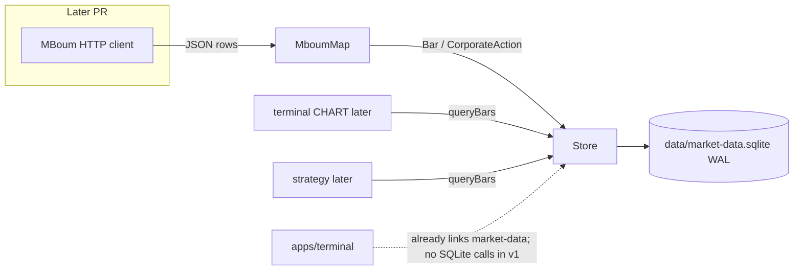
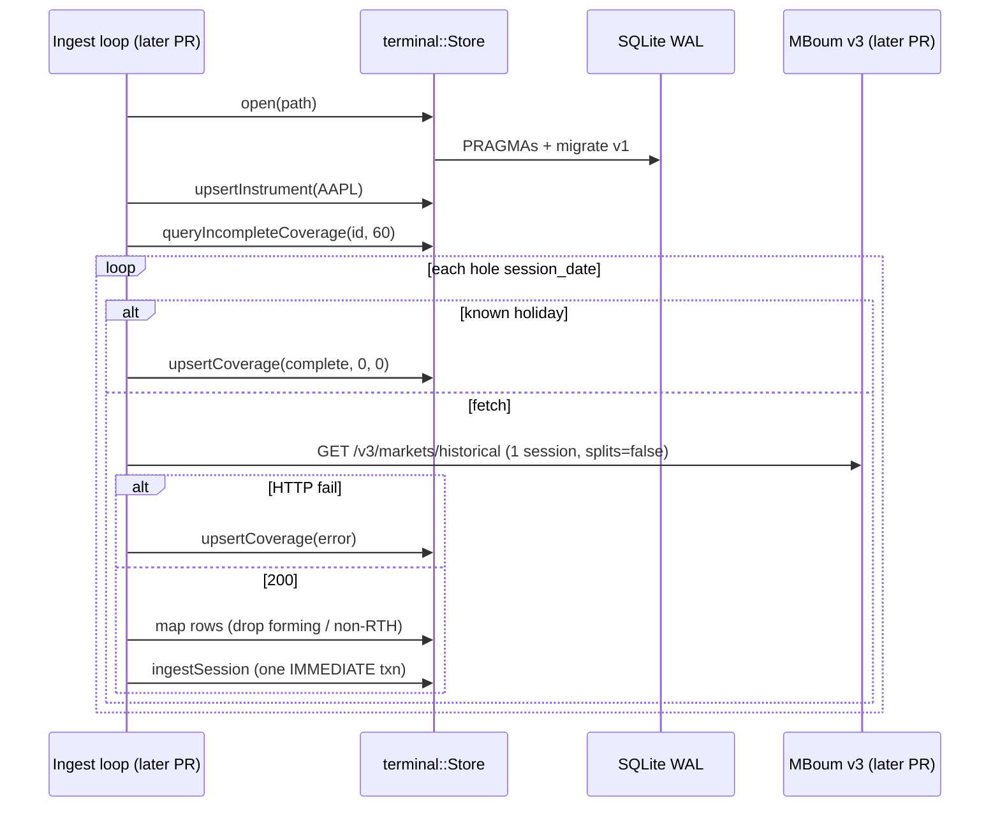
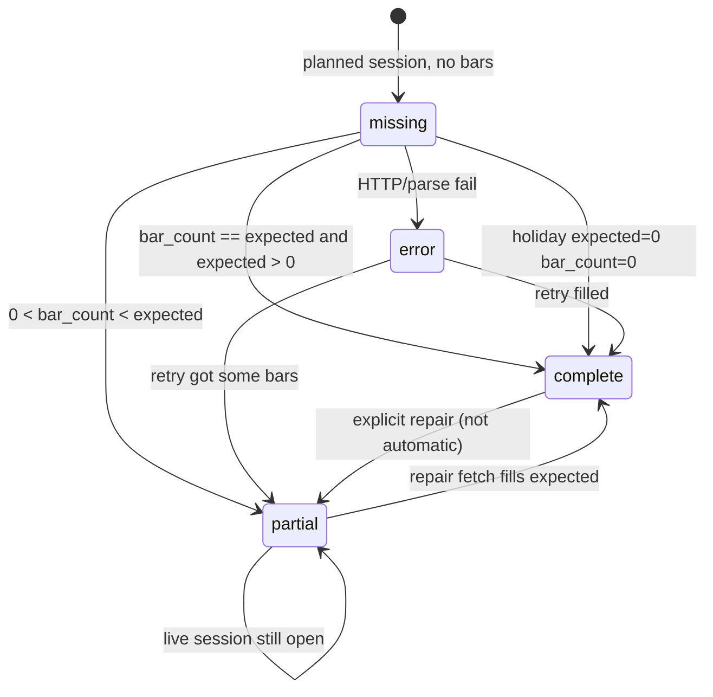
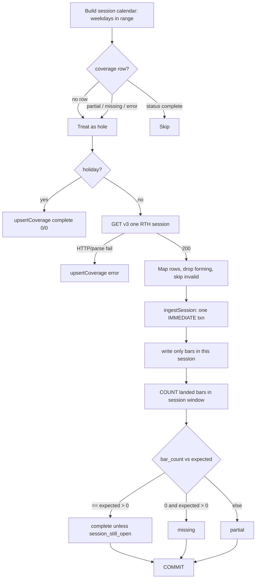

# SQLite market-data store (schema v1)

| Field | Value |
|---|---|
| Status | Draft |
| Date | 2026-09-19 (revised 2026-09-20) |
| Author | cynickal |
| Audience | Implementer of `libs/market-data` |
| Repo | `/home/cynickal/CLionProjects/MyApp` |
| Related (do not confuse) | `docs/design.md` is the ImGui visual spec. This document is the **on-disk schema and C++ store**. Recommend in-repo copy at `docs/market-data-store.md`. |
| Superseded in part | Instrument identity follows `docs/composite-figi-identity.md` (2026-09-23). `libs/market-data/schema/v4.sql` is the baseline schema; v1 to v3 were retired and their files refuse to open. K12, the `instrument` DDL below, and Alternative 8 describe v1. |

This is an implementation spec. An engineer should be able to create the database, write the C++ access layer, and ingest 1-minute MBoum bars without inventing remaining design. Product decisions already made (four tables, no `ingest_run`, as-traded bars, `coverage_day` as inventory) are **not reopened**.

---

## Schema version 5

`user_version` is 5 (`kSchemaUserVersion`). `libs/market-data/schema/v4.sql` is the frozen FIGI baseline. `libs/market-data/schema/v5.sql` adds `portfolio` and `portfolio_holding` and does not change the v4 tables. How FIGI and listings work is in `docs/composite-figi-identity.md`.

`Store` reads `PRAGMA user_version` on open.

- An empty database (`user_version` 0) applies `v4.sql`, then `v5.sql`, and is stamped 5.
- A healthy version-4 file (the v4 tables and the `instrument_current` view are present) applies `v5.sql` only and is stamped 5. A version-4 file missing one of those throws and is not stamped.
- Versions 1–3 still get the existing reset message and are not migrated: `market-data.sqlite is schema v<N>. v4 changed instrument identity and does not migrate. Close the terminal, delete <path> and its -wal and -shm files, and re-ingest.`
- A newer `user_version` is refused (`database user_version exceeds this binary`).
- A complete file already stamped 5 (the v4 tables, `instrument_current`, `portfolio`, and `portfolio_holding`) is opened without running `v5.sql` again. A stamped-5 file missing one of those throws and does not finish.

The instrument on a non-cash holding is resolved from its FIGI. `replaceHoldings` calls `findInstrumentByFigi` and stores `instrument_id` (`REFERENCES instrument(id) ON DELETE RESTRICT`). Equity and ETF rows are unique on portfolio and instrument. An option row is further keyed by expiration, expiration type, strike, and right. Cash has no FIGI and is the only null `instrument_id`. `queryHoldings` returns the FIGI (`instrument.figi`) and the current symbol (`instrument_current.symbol`).

Re-ingest of bars, statements, and option chains does not change a holding's quantity. It must not delete an instrument a book still holds. `portfolio_holding.instrument_id` is `ON DELETE RESTRICT`, so that delete fails while the row remains.

Before upgrading, quit the terminal and ingest, then copy `data/market-data.sqlite` plus the `-wal` and `-shm` sidecars. Restore those copies to undo. Do not hand-edit `user_version` backward.

`portfolioFetchJobs` (`apps/terminal/src/data/PortfolioFetch.h`) plans an existing `IngestWorker::Job` by holding kind. An open equity or ETF listing is planned only when daily coverage has no `bar_count > 0`. An open option listing is planned only when no quote for that expiration and expiration type matches the holding's strike and right. One options job is shared per symbol and expiration, not emitted per holding. Cash and a closed listing plan nothing. There is no portfolio panel.

---

## Overview

The terminal needs a local, reusable, persistent market-data store for charting and strategy training. The GUI (`apps/terminal`) already links the `market-data` library but does not read SQLite; CHART is hardcoded quote chips. The empty file `data/market-data.sqlite` (0 bytes, not a SQLite database yet) is the intended runtime DB. `libs/market-data/` already exists as a CMake target and is the home for the store.

v1 is a SQLite database with four STRICT tables — `instrument`, `bar`, `corporate_action`, `coverage_day` — owned by a RAII C++ `Store` in namespace `terminal`. Canonical grain is 1-minute as-traded OHLCV. Splits and dividends live in `corporate_action` and are applied at read time later; they are **not** baked into `bar`. Completeness is tracked per instrument/timeframe/session in `coverage_day` so a downloader can find holes without scanning bars. There is no `ingest_run` table.

The store does **not** include an HTTP client. It does pin MBoum field mapping, timezone conversion, upsert SQL, coverage maintenance, and the C++ API so a later ingest PR has nothing left to invent about the database.

---

## Background & Motivation

### Current state

Verified against `/home/cynickal/CLionProjects/MyApp` on 2026-09-20.

| Piece | Path | Reality |
|---|---|---|
| Superproject | `CMakeLists.txt` | `project(terminal LANGUAGES CXX)`, C++20. **Already** `add_subdirectory(libs/market-data)` then `add_subdirectory(apps/terminal)` (lines 31–32) |
| CMake target | `libs/market-data/CMakeLists.txt` | Target name **`market-data`** (hyphen). Sources: `CBarData.cpp/.h`, `CBarSeries.cpp/.h`, `market-data.h`. Public include dir = `libs/market-data/src`. clang-tidy + `-Wall -Wextra` already on |
| Terminal link | `apps/terminal/CMakeLists.txt` lines 55–58 and 76–78 | `terminal` and `terminal_tests` already `target_link_libraries(... PRIVATE market-data)`. **Keep both link lines.** No `CBarLoader`. No `apps/terminal/src/data/` |
| Leftover DTO | `libs/market-data/src/CBarData.{h,cpp}` | Global-namespace Hungarian `CBarData`: `float` OHLCV, unzoned `system_clock`. **Nothing in `apps/terminal/src` includes it.** Delete in PR 1 |
| Leftover series | `libs/market-data/src/CBarSeries.{h,cpp}` | Global-namespace `CBarSeries` wrapping `vector<CBarData>` plus `m_Symbol` / `m_Timeframe` / `Adjustment`. `.cpp` is include-only. Unused. Delete in PR 1 |
| Leftover API | `libs/market-data/src/market-data.h` | Declares `market_data::GetBarData` → `CBarSeries` (no `.cpp` definition). Link error only if called; nothing in `apps/` calls it. Delete in PR 1 |
| Lib tests | `libs/market-data/tests/` | Empty directory |
| Terminal tests | `apps/terminal/tests/data/bar_loading_tests.h` | Catch2 stub `CHECK(true)`; no CSV loader. `test_main.cpp` still includes it |
| GUI | `apps/terminal/src/ui/Workspace.cpp` | CHART is hardcoded quote chips. Nothing reads SQLite |
| Empty DB | `data/market-data.sqlite` | Tracked **0-byte** file; not a SQLite database yet |
| SQLite | `deps/sqlite/{sqlite3.c,sqlite3.h,sqlite3ext.h,shell.c}` | Amalgamation **3.53.4** (`SQLITE_VERSION_NUMBER 3053004`). Not in CMake yet. `shell.c` is CLI, not linked |
| Catch2 | `deps/catch/catch_amalgamated.{hpp,cpp}` | v3 amalgamated; same pattern as `terminal_tests` |
| Gitignore | `.gitignore` | Build artifacts, `.idea/`, binaries. **Does not** ignore `*.sqlite` |
| Theme spec | `docs/design.md` | Unrelated visual language. Do not mix |
| clang-tidy | `.clang-tidy` | `HeaderFilterRegex: '.*/src/.*'` already matches `libs/market-data/src/` |

### Pain

There is no durable 1-minute history. Training and charting need years of bars, idempotent re-ingest, survivorship (delisted names stay), and a way to resume after a crash without a job-log table. Scanning `bar` for missing days is the wrong query; `coverage_day` is the checklist. The existing `market-data` target is the right extraction point; it currently only holds unused Hungarian DTOs (`CBarData`, `CBarSeries`) and an unimplemented `GetBarData`.

---

## Goals & Non-Goals

### Goals

1. Canonical DDL for schema `user_version = 1`, applied to an empty file.
2. RAII C++ `Store` that opens the DB, sets PRAGMAs, migrates, upserts, and queries.
3. Idempotent 1-minute ingest from mapped MBoum rows (HTTP client is a later PR; mapping is specified here).
4. `coverage_day` hole detection so ingest is `WHERE status != 'complete'`.
5. Catch2 tests under `libs/market-data/tests/`.
6. Evolve the existing `market-data` CMake target in place (amalgamation, schema, `Store`). Keep the existing unused `terminal` / `terminal_tests` link; do not add a second subdirectory.

### Non-goals (v1)

| Out | Why |
|---|---|
| `ingest_run` table / `ingest_run_id` | Explicitly skipped. Add later if downloads fail in ways `coverage_day.error` cannot express |
| Parquet / Arrow | User chose SQLite |
| Tick, L2, quotes, news | Different grain |
| Indicator columns, vendor JSON, `adj_close` on `bar` | Derive at read; do not densify the bulk table |
| Materialized 5m/1h/1d tables | `timeframe_s` already allows them; v1 writes `60` only |
| Full MBoum HTTP client, retries, 429 loop, ingest CLI | Later follow-on (not required to finish the store). This spec pins field maps, `splits=false`, and timezone conversion only |
| Strategy engine, chart renderer | Consumers of `Store::queryBars` |
| Keeping `CBarData` / `CBarSeries` / `GetBarData` | Dead leftovers. Delete in PR 1. New type is `terminal::Bar` |
| Dividend adjustment on the read path | Splits are adjusted in memory by `adjustBarsForSplits`. Cash dividends stay unadjusted |
| Sharing one `sqlite3*` across threads without a mutex | Forbidden; see Concurrency |
| CASCADE delete of years of bars | Forbidden; see FK policy |

---

## Key Decisions

| # | Decision | Rationale |
|---|---|---|
| K1 | Four tables only: `instrument`, `bar`, `corporate_action`, `coverage_day`. No `ingest_run`. | Product. Crash recovery = retry rows with `status != 'complete'`. |
| K2 | Home is the existing CMake target **`market-data`** (hyphen). Namespace `terminal`. New types are **not** Hungarian `CBarData`. Delete `CBarData.{h,cpp}`, `CBarSeries.{h,cpp}`, and `market-data.h` (`GetBarData`) in PR 1. Do not keep a deprecated GUI DTO. | Target and terminal link already exist. Nothing in `apps/terminal/src` includes these types. `CBarData` is `float` + unzoned `system_clock`; `CBarSeries` is an unused wrapper. New code matches `Application`/`Window` (`pragma once`, `namespace terminal`, `snake_case_` members). |
| K3 | Canonical schema file is `libs/market-data/schema/v1.sql`, compiled into the binary. | Schema next to the code that owns it. `docs/` stays prose. Runtime must not depend on cwd to find SQL. |
| K4 | `PRAGMA user_version` is the migration counter. v1 = create-from-empty. | No ALTER story yet. Newer binary applies `vN.sql` in order; older binary refuses `user_version > kCurrent`. |
| K5 | Populated `data/*.sqlite` (and `-wal`/`-shm`) are gitignored. Schema SQL is tracked. Delete the 0-byte placeholder from git. | File will contain licensed vendor history and is not source. |
| K6 | One `bar` table with `timeframe_s`. Canonical v1 writes are `timeframe_s = 60`. | Daily later is `86400` without a new table. PK range scan is `(instrument_id, timeframe_s, ts)`. |
| K7 | `WITHOUT ROWID` + composite PK on `bar` and `coverage_day`. | Skinny bulk table; PK **is** the lookup. Avoids a 64-bit rowid per bar. |
| K8 | `STRICT` on all four tables. | Affinity will not silently turn `'foo'` into `0`. Invalid binds fail. |
| K9 | As-traded bars. `corporate_action` at read. MBoum v3 `splits=false`, `dividends=false`. | Mixing adjusted 1-minute data is hard to undo. Vendor default is `splits=true` — must override. |
| K10 | No `session_date` on `bar`. | Session identity lives on `coverage_day`. Bar key is UTC `ts`. |
| K11 | `ON DELETE RESTRICT` from children to `instrument`. | Do not silently delete years of bars. No `deleteInstrument` in v1 API. |
| K12 | *Superseded by schema v4.* The integer `instrument.id` joins every fact row. The OpenFIGI composite FIGI (the index FIGI for an index) is required for equities, ETFs, and indexes and unique when present. The live ticker is the open row in `instrument_listing`; there is no `exchange` column. See `docs/composite-figi-identity.md`. | v1 keyed on `(symbol, exchange)`: a rename split one security into two rows and a recycled ticker merged two securities into one. |
| K13 | All timestamps except `session_date` are UTC unix **seconds** (`INTEGER`). `session_date` is `YYYYMMDD` in `instrument.timezone`. Bar `ts` is the **open** of the minute, aligned to `timeframe_s`. | Never key on vendor display strings. |
| K14 | v3 naive `datetime` is interpreted in `instrument.timezone` via IANA tzdb (`std::chrono::locate_zone`). v2 prefers `timestamp_unix`. | DST is real for America/New_York. Host must have `/usr/share/zoneinfo`. |
| K15 | v1 `expected_count = 390` for US RTH (equity/etf/index, `America/New_York`). Early closes ⇒ `partial`. Holidays are caller-supplied `complete` with `0/0`, never `missing`. | 6.5h × 60 = 390. Half-day calendar is a later refinement. |
| K16 | v1 ingest requests **one session per MBoum call** (RTH window). Skip the forming in-progress minute. | Aligns 1:1 with `coverage_day`. 4000-row pages are unused in v1 (kept as a documented option). |
| K17 | Error policy: `std::runtime_error`, same as `VulkanContext` / `Window`. | One policy in the tree. No `std::expected` in v1. (`CBarLoader` is gone.) |
| K18 | Prices and volume in C++ are `double` (SQLite `REAL`). | Charting/training v1 does not need tick-level decimal exactness. Integer mills would force a scale column per instrument; not worth it until FX/crypto ticks. |
| K19 | One writer connection, N reader connections. Never share `sqlite3*` across threads without a mutex. `SQLITE_THREADSAFE=1`. Writer `busy_timeout=5000`. GUI `Store` uses `busy_timeout=0` (try once) and keeps the last successful query. | A 5s wait on the GUI thread stalls frames. WAL still allows concurrent readers. |
| K20 | `corporate_action` is created empty in the schema PR even if split ingest is later. | Avoid a v2 ALTER for a table we already agreed exists. |
| K21 | CHECK / non-finite / unaligned bars: skip the row (`rejected++`), continue the batch. Coverage status uses **landed** `bar_count` vs `expected_count` only. Mapper filters (non-RTH, forming) are not rejects. **All writers** (`upsertBars` and `ingestSession`) drop forming minutes before bind without incrementing `rejected`. `session_still_open` is the live-session `partial` switch. | Forcing `partial` on any skip would leave every normal RTH day `partial` forever (16:00 / forming extras). Public `upsertBars` must not persist a live incomplete minute. If a real RTH bar is CHECK-rejected, `bar_count < expected` already yields `partial`. |
| K22 | Root `project(terminal LANGUAGES C CXX)`. Keep CMake target name `market-data`. Keep the existing unused `terminal` / `terminal_tests` link. Do not `add_subdirectory(libs/market-data)` a second time. | Root is `LANGUAGES CXX` today; amalgamation is C. A one-line `LANGUAGES C CXX` on `project()` is the usual CMake 4 fix (not a superproject rewrite). Do not `enable_language(C)` in the lib. The subdirectory and link already exist — PR 1 evolves them. |
| K23 | `Store` is a pimpl. SQLite wrappers live in `libs/market-data/private/` (PRIVATE include dir, **not** under the public `src/` tree). `terminal_sqlite3` is linked **PRIVATE**; its sqlite include dir is **PRIVATE**. | Consumers (`terminal`) must not see `sqlite3.h`, `Sqlite.h`, or `SqliteDb::handle()`. Putting `internal/` under `src/market_data/` would still be `#include`-able via the public include dir. |
| K24 | Public write APIs each open one `BEGIN IMMEDIATE` when `sqlite3_get_autocommit(db)` is true. `ingestSession` opens the only txn and calls `_unlocked` helpers that never `BEGIN`. Nested `SqliteTxn` throws. | Nested `BEGIN IMMEDIATE` is `SQLITE_ERROR`. |
| K25 | `expected_count` parameters default to `std::nullopt`. Callers pass `kUsRthExpected1m` (390) for US RTH. | A default of 390 would mis-mark crypto/futures as `missing`/`partial`. |

---

## Proposed Design

### On-disk artifacts

| Artifact | Path | Git | Role |
|---|---|---|---|
| Database | `data/market-data.sqlite` | **ignored** once populated | Runtime DB. `Store` takes an explicit path; this is the repo convention (relative to process cwd, typically repo root or `build/`). |
| WAL / SHM | `data/market-data.sqlite-wal`, `data/market-data.sqlite-shm` | ignored | WAL sidecar. Never commit. |
| Canonical DDL | `libs/market-data/schema/v1.sql` | tracked | Source of truth. Applied when `user_version = 0`. |
| Future DDL | `libs/market-data/schema/v2.sql`, … | tracked when needed | Append-only migrations. |
| Placeholder | current 0-byte `data/market-data.sqlite` | **untrack** | Not a database. Replace with `data/.gitkeep`. |

`.gitignore` additions:

```
# Market-data runtime DB (licensed history; schema SQL is tracked)
data/*.sqlite
data/*.sqlite-wal
data/*.sqlite-shm
data/*.sqlite-journal
```

`Store` does not hard-code the path. Apps/tools pass `data/market-data.sqlite` or a test temp path. Do not store the MBoum bearer token in the DB, in schema, or in git.

### Library layout (evolve existing target)

Keep `libs/market-data/CMakeLists.txt` and the CMake target name **`market-data`**. Nested public headers match `apps/terminal/src/terminal/Application.h`. SQLite wrappers are **internal**.

**Delete in PR 1:** `src/CBarData.h`, `src/CBarData.cpp`, `src/CBarSeries.h`, `src/CBarSeries.cpp`, `src/market-data.h`.

```
libs/market-data/
  CMakeLists.txt                 # already exists; evolve, do not add a second target
  schema/
    v1.sql
  private/                       # PRIVATE include dir — not under src/
    Sqlite.h
    Sqlite.cpp
  src/
    market_data/
      Types.h                         # public (PR 1)
      SqliteVersion.h / .cpp          # public wrapper; only extra .cpp in PR 1
      Time.h / Time.cpp               # public: tz conversion (PR 4). Includes Types.h; no alias redeclares
      MboumMap.h / MboumMap.cpp       # public: v3/v2 row → Bar (PR 6)
      Store.h / Store.cpp             # public: pimpl Store (PR 2+). Store.h does NOT include Sqlite.h
      Schema.h / Schema.cpp           # kSchemaV1 string (PR 2)
  tests/
    test_main.cpp
    sqlite_version_tests.h       # PR 1
    schema_tests.h
    store_tests.h
    time_tests.h
    coverage_tests.h
    mboum_map_tests.h
```

Public include dir: `libs/market-data/src`. Consumers write `#include "market_data/Store.h"`. They must not be able to `#include "sqlite3.h"` or `Sqlite.h` via the public interface. `Store.cpp` includes `"Sqlite.h"` because `private/` is a PRIVATE include dir.

### Schema embed (complete CMake; no leftover fragments)

`v1.sql` uses no `)SQL` token (true of the DDL in this spec). Generate a header in the **binary** dir and include it from `Schema.cpp`.

`src/market_data/schema_v1.inc.in`:

```cpp
static constexpr char kSchemaV1[] = R"SQL(
@MARKET_DATA_SCHEMA_V1@
)SQL";
```

`libs/market-data/CMakeLists.txt` (this fragment is normative):

```cmake
file(READ "${CMAKE_CURRENT_SOURCE_DIR}/schema/v1.sql" MARKET_DATA_SCHEMA_V1)
configure_file(
    "${CMAKE_CURRENT_SOURCE_DIR}/src/market_data/schema_v1.inc.in"
    "${CMAKE_CURRENT_BINARY_DIR}/schema_v1.inc"
    @ONLY
)
```

`Schema.cpp`:

```cpp
#include "schema_v1.inc"  // generated; kSchemaV1
```

`target_include_directories(market-data PRIVATE ${CMAKE_CURRENT_BINARY_DIR})` so `Schema.cpp` finds the inc. Drift-guard tests read `v1.sql` via compile def `TERMINAL_MARKET_DATA_SCHEMA_DIR` set on **`market_data_tests`** (not only PRIVATE on the lib — PRIVATE does not propagate).

### CMake wire-up

Root `CMakeLists.txt` **today already** has `add_subdirectory(libs/market-data)` then `add_subdirectory(apps/terminal)`. Do not add it again.

One-line superproject change:

```cmake
project(terminal LANGUAGES C CXX)   # was LANGUAGES CXX; amalgamation is C
```

`apps/terminal/CMakeLists.txt` already contains:

```cmake
target_link_libraries(terminal PRIVATE
    market-data
    glfw
    Vulkan::Vulkan
)
# and terminal_tests: target_link_libraries(terminal_tests PRIVATE market-data)
```

**Leave those two link lines as they are.** Unlinking is a needless terminal diff that would have to be re-added when CHART reads `Store`. The link is unused until then; it is not a call into SQLite.

### PR 1 `libs/market-data/CMakeLists.txt` (copy-paste this, not the end-state list)

A STATIC library with only a header and a PRIVATE sqlite dep is generator-dependent and can fail configure. PR 1 therefore ships one real C++ TU: `SqliteVersion.cpp`. Tests assert through that wrapper so they never `#include "sqlite3.h"`. `terminal` still cannot see sqlite headers.

```cmake
add_library(terminal_sqlite3 STATIC
    ${CMAKE_SOURCE_DIR}/deps/sqlite/sqlite3.c
)
target_include_directories(terminal_sqlite3 PRIVATE ${CMAKE_SOURCE_DIR}/deps/sqlite)
target_compile_definitions(terminal_sqlite3 PRIVATE
    SQLITE_THREADSAFE=1
    SQLITE_DQS=0
    SQLITE_DEFAULT_MEMSTATUS=0
    SQLITE_OMIT_DEPRECATED
    SQLITE_OMIT_LOAD_EXTENSION
    SQLITE_USE_URI=1
)
set_source_files_properties(${CMAKE_SOURCE_DIR}/deps/sqlite/sqlite3.c PROPERTIES SKIP_LINTING ON)
set_target_properties(terminal_sqlite3 PROPERTIES
    C_CLANG_TIDY ""
    CXX_CLANG_TIDY ""
)
if(UNIX AND NOT APPLE)
    find_package(Threads REQUIRED)
    target_link_libraries(terminal_sqlite3 PUBLIC Threads::Threads ${CMAKE_DL_LIBS} m)
endif()

add_library(market-data STATIC
    src/market_data/SqliteVersion.cpp
)
target_include_directories(market-data
    PUBLIC  ${CMAKE_CURRENT_SOURCE_DIR}/src
    PRIVATE ${CMAKE_SOURCE_DIR}/deps/sqlite
)
target_link_libraries(market-data PRIVATE terminal_sqlite3)
if(UNIX AND NOT APPLE)
    target_link_libraries(market-data PUBLIC Threads::Threads ${CMAKE_DL_LIBS} m)
endif()
target_compile_features(market-data PUBLIC cxx_std_20)
target_compile_options(market-data PRIVATE
    $<$<CXX_COMPILER_ID:GNU,Clang,AppleClang>:-Wall;-Wextra>
)

if(TERMINAL_ENABLE_CLANG_TIDY)
    set_target_properties(market-data PROPERTIES
        CXX_CLANG_TIDY "${CLANG_TIDY_EXE};--quiet;-extra-arg=-Wno-unknown-warning-option"
    )
endif()

if(CYN_TESTING)
    add_executable(market_data_tests
        tests/test_main.cpp
        ${CMAKE_SOURCE_DIR}/deps/catch/catch_amalgamated.cpp
    )
    target_link_libraries(market_data_tests PRIVATE market-data)
    target_include_directories(market_data_tests PRIVATE
        ${CMAKE_CURRENT_SOURCE_DIR}/src
        ${CMAKE_CURRENT_SOURCE_DIR}/tests
        ${CMAKE_SOURCE_DIR}/deps/catch
    )
    target_compile_options(market_data_tests PRIVATE
        $<$<CXX_COMPILER_ID:GNU,Clang,AppleClang>:-Wall;-Wextra>
    )
    add_test(NAME market_data_tests COMMAND market_data_tests)
    if(TERMINAL_ENABLE_CLANG_TIDY)
        set_target_properties(market_data_tests PROPERTIES
            CXX_CLANG_TIDY "${CLANG_TIDY_EXE};--quiet;-extra-arg=-Wno-unknown-warning-option"
        )
        set_source_files_properties(
            ${CMAKE_SOURCE_DIR}/deps/catch/catch_amalgamated.cpp
            PROPERTIES SKIP_LINTING ON
        )
    endif()
endif()
```

`src/market_data/SqliteVersion.h`:

```cpp
#pragma once

namespace terminal {

// Thin wrap of sqlite3_libversion_number so tests/GUI never include sqlite3.h.
[[nodiscard]] int sqliteLibVersionNumber();

}  // namespace terminal
```

`src/market_data/SqliteVersion.cpp` (PRIVATE sqlite include dir on `market-data` is what makes `"sqlite3.h"` resolve here):

```cpp
#include "market_data/SqliteVersion.h"

#include "sqlite3.h"

namespace terminal {

int sqliteLibVersionNumber()
{
    return sqlite3_libversion_number();
}

}  // namespace terminal
```

PR 1 test:

```cpp
#include "market_data/SqliteVersion.h"
CHECK(terminal::sqliteLibVersionNumber() == 3053004);
```

Do **not** `#include "sqlite3.h"` from `market_data_tests` or `terminal`. Do not add `deps/sqlite` to those targets' include dirs.

### End of PR 7 `libs/market-data/CMakeLists.txt` (append sources; do not paste this in PR 1)

Each later PR **appends** its `.cpp` to `add_library(market-data STATIC ...)`. After PR 7 the source list is:

```cmake
add_library(terminal_sqlite3 STATIC
    ${CMAKE_SOURCE_DIR}/deps/sqlite/sqlite3.c
)
target_include_directories(terminal_sqlite3 PRIVATE ${CMAKE_SOURCE_DIR}/deps/sqlite)
target_compile_definitions(terminal_sqlite3 PRIVATE
    SQLITE_THREADSAFE=1
    SQLITE_DQS=0
    SQLITE_DEFAULT_MEMSTATUS=0
    SQLITE_OMIT_DEPRECATED
    SQLITE_OMIT_LOAD_EXTENSION
    SQLITE_USE_URI=1
)
set_source_files_properties(${CMAKE_SOURCE_DIR}/deps/sqlite/sqlite3.c PROPERTIES SKIP_LINTING ON)
set_target_properties(terminal_sqlite3 PROPERTIES
    C_CLANG_TIDY ""
    CXX_CLANG_TIDY ""
)
# Do not pass -Wall to the amalgamation. Do not compile shell.c.
if(UNIX AND NOT APPLE)
    find_package(Threads REQUIRED)
    target_link_libraries(terminal_sqlite3 PUBLIC Threads::Threads ${CMAKE_DL_LIBS} m)
endif()

add_library(market-data STATIC
    src/market_data/SqliteVersion.cpp   # PR 1
    private/Sqlite.cpp                  # PR 2
    src/market_data/Schema.cpp          # PR 2
    src/market_data/Store.cpp           # PR 2
    src/market_data/Time.cpp            # PR 4
    src/market_data/MboumMap.cpp        # PR 6
)
target_include_directories(market-data
    PUBLIC  ${CMAKE_CURRENT_SOURCE_DIR}/src
    PRIVATE ${CMAKE_CURRENT_SOURCE_DIR}/private          # PR 2
    PRIVATE ${CMAKE_SOURCE_DIR}/deps/sqlite              # SqliteVersion.cpp + Sqlite.cpp only
    PRIVATE ${CMAKE_CURRENT_BINARY_DIR}                  # PR 2 schema_v1.inc
)
target_link_libraries(market-data PRIVATE terminal_sqlite3)
if(UNIX AND NOT APPLE)
    # PRIVATE link of a static sqlite does not propagate Threads/dl/m to
    # terminal / market_data_tests. Re-export the link libs, not sqlite headers.
    target_link_libraries(market-data PUBLIC Threads::Threads ${CMAKE_DL_LIBS} m)
endif()
target_compile_features(market-data PUBLIC cxx_std_20)
target_compile_options(market-data PRIVATE
    $<$<CXX_COMPILER_ID:GNU,Clang,AppleClang>:-Wall;-Wextra>
)

if(TERMINAL_ENABLE_CLANG_TIDY)
    set_target_properties(market-data PROPERTIES
        CXX_CLANG_TIDY "${CLANG_TIDY_EXE};--quiet;-extra-arg=-Wno-unknown-warning-option"
    )
endif()

if(CYN_TESTING)
    add_executable(market_data_tests
        tests/test_main.cpp
        ${CMAKE_SOURCE_DIR}/deps/catch/catch_amalgamated.cpp
    )
    target_link_libraries(market_data_tests PRIVATE market-data)
    target_include_directories(market_data_tests PRIVATE
        ${CMAKE_CURRENT_SOURCE_DIR}/src
        ${CMAKE_CURRENT_SOURCE_DIR}/tests
        ${CMAKE_SOURCE_DIR}/deps/catch
    )
    target_compile_definitions(market_data_tests PRIVATE
        TERMINAL_MARKET_DATA_SCHEMA_DIR="${CMAKE_CURRENT_SOURCE_DIR}/schema"
    )
    target_compile_options(market_data_tests PRIVATE
        $<$<CXX_COMPILER_ID:GNU,Clang,AppleClang>:-Wall;-Wextra>
    )
    add_test(NAME market_data_tests COMMAND market_data_tests)
    if(TERMINAL_ENABLE_CLANG_TIDY)
        set_target_properties(market_data_tests PROPERTIES
            CXX_CLANG_TIDY "${CLANG_TIDY_EXE};--quiet;-extra-arg=-Wno-unknown-warning-option"
        )
        set_source_files_properties(
            ${CMAKE_SOURCE_DIR}/deps/catch/catch_amalgamated.cpp
            PROPERTIES SKIP_LINTING ON
        )
    endif()
endif()
```

Notes:

- Target name stays **`market-data`**. Tests executable is `market_data_tests` (underscore is fine for a binary).
- `terminal_sqlite3` include dir is **PRIVATE**. `market-data` links it **PRIVATE**. CMake 4 still pulls the static `.a` into `market_data_tests` / `terminal`; sqlite **headers** do not propagate.
- The only TUs allowed to `#include "sqlite3.h"` are `src/market_data/SqliteVersion.cpp` and (from PR 2) `private/Sqlite.cpp`. Tests call `terminal::sqliteLibVersionNumber()`. `terminal` never includes sqlite headers.
- Unix `Threads` / `dl` / `m` are re-exported `PUBLIC` on `market-data` so the GUI link does not hit undefined pthread refs. That does **not** put `sqlite3.h` on the consumer include path.
- `.clang-tidy` `HeaderFilterRegex: '.*/src/.*'` already matches `libs/market-data/src/`. Do not lint `deps/sqlite`. `C_CLANG_TIDY=""` on `terminal_sqlite3` is required because `WarningsAsErrors: '*'` would fail the amalgamation even if SKIP_LINTING is set on the `.c` file.
- Do not compile `deps/sqlite/shell.c`.
- PR 2 adds `TERMINAL_MARKET_DATA_SCHEMA_DIR` on **`market_data_tests`** (not only PRIVATE on the lib).

### Architecture







---

## Connection PRAGMAs

Apply on **every** `sqlite3_open*`, including readers. `foreign_keys` is **not** persistent. `journal_mode=WAL` persists on the file after the first set; still set it every time.

```sql
PRAGMA foreign_keys = ON;
PRAGMA journal_mode = WAL;
PRAGMA synchronous  = NORMAL;
PRAGMA busy_timeout = <ms>;   -- 5000 writer, 0 GUI reader; see StoreMode
```

`user_version` is read after open. It is **not** set to 1 on a blank connection before DDL; the migrator sets it after `v1.sql` succeeds.

| PRAGMA | Value | Why |
|---|---|---|
| `foreign_keys` | `ON` | Enforce `REFERENCES instrument(id)` |
| `journal_mode` | `WAL` | Concurrent GUI readers during ingest |
| `synchronous` | `NORMAL` | Correct with WAL; `FULL` is unnecessary for local training data |
| `busy_timeout` | **5000 ms** on `StoreMode::Writer`; **0** on `StoreMode::Reader` | Writer waits 5s then `SQLITE_BUSY` → `runtime_error`. GUI must not stall a frame for 5s; try once and keep the last successful query |
| `user_version` | `1` after v1 DDL | Migration counter |
| `temp_store` | default | Do not pin |
| `cache_size` | default | Revisit if 200×5y scans hurt |

Open flags: `SQLITE_OPEN_READWRITE | SQLITE_OPEN_CREATE | SQLITE_OPEN_FULLMUTEX | SQLITE_OPEN_URI`. Tests may use `file:memdb1?mode=memory&cache=shared` or a temp file. Prefer a temp file for WAL tests (`std::filesystem::temp_directory_path()` + unique name, delete on teardown including `-wal`/`-shm`).

Write transactions use `BEGIN IMMEDIATE` so the reserved lock is taken up front (no `SQLITE_BUSY` on `COMMIT` upgrade).

### Transaction ownership (normative)

Nested `BEGIN IMMEDIATE` returns `SQLITE_ERROR` (“cannot start a transaction within a transaction”). One rule:

| API | Transaction |
|---|---|
| `upsertInstrument`, `upsertBars`, `upsertCoverage`, `upsertCorporateAction`, `refreshCoverageFromBars` | If `sqlite3_get_autocommit(db) != 0`, the method constructs `SqliteTxn` (`BEGIN IMMEDIATE`). Commit on success; destructor rolls back otherwise. |
| `ingestSession` | Always constructs **one** `SqliteTxn`, then calls `upsertBarsUnlocked` + `refreshCoverageFromBarsUnlocked`. Those helpers **never** `BEGIN`. |
| Queries | No `BEGIN`. |
| `migrate` (user_version 0) | Own `SqliteTxn` around DDL + `user_version=1`. |

`SqliteTxn` ctor: if `!sqlite3_get_autocommit(db)`, throw `std::runtime_error("nested transaction")`. No SAVEPOINTs in v1.

`upsertBars` (public): whole-batch atomicity for FK/bind errors — one bad FK rolls back every bar in that call. CHECK/non-finite/unaligned rows are skipped (`rejected++`) **inside** the open txn; they do not abort the batch. Standalone `upsertBars` therefore still commits the valid rows of that call.

`ingestSession`: one txn for (accepted bars + coverage). Rollback drops both.

---

## Complete DDL (`libs/market-data/schema/v1.sql`)

> **Historical.** `v1.sql` was retired with schema v4. The current baseline is `libs/market-data/schema/v4.sql`: the fact tables below are unchanged, and `instrument` is replaced by `instrument` (FIGI, no symbol or exchange) plus `instrument_listing` and the `instrument_current` view.

This is the entire v1 script. Apply inside a single transaction from C++ (`BEGIN IMMEDIATE` … `COMMIT`). Do not rely on `sqlite3` CLI being on PATH.

```sql
-- market-data schema v1
-- Applied only when PRAGMA user_version = 0.
-- Idempotent: CREATE IF NOT EXISTS so a crashed migrate can retry
-- after a rollback; user_version is set only after success.

CREATE TABLE IF NOT EXISTS instrument (
    id            INTEGER PRIMARY KEY,
    symbol        TEXT    NOT NULL COLLATE NOCASE,
    exchange      TEXT,
    asset_class   TEXT    NOT NULL DEFAULT 'equity'
                    CHECK (asset_class IN ('equity','etf','index','future','crypto','other')),
    currency      TEXT    NOT NULL DEFAULT 'USD',
    timezone      TEXT    NOT NULL DEFAULT 'America/New_York',
    name          TEXT,
    listed_at     INTEGER,
    delisted_at   INTEGER,
    created_at    INTEGER NOT NULL,
    CHECK (listed_at IS NULL OR listed_at >= 0),
    CHECK (delisted_at IS NULL OR delisted_at >= 0),
    CHECK (created_at >= 0),
    CHECK (delisted_at IS NULL OR listed_at IS NULL OR delisted_at >= listed_at)
) STRICT;

CREATE UNIQUE INDEX IF NOT EXISTS instrument_symbol_exchange
    ON instrument (symbol COLLATE NOCASE, ifnull(exchange, ''));

CREATE TABLE IF NOT EXISTS bar (
    instrument_id INTEGER NOT NULL
                    REFERENCES instrument(id) ON DELETE RESTRICT ON UPDATE RESTRICT,
    timeframe_s   INTEGER NOT NULL CHECK (timeframe_s > 0),
    ts            INTEGER NOT NULL CHECK (ts >= 0),
    open          REAL    NOT NULL,
    high          REAL    NOT NULL,
    low           REAL    NOT NULL,
    close         REAL    NOT NULL,
    volume        REAL    NOT NULL CHECK (volume >= 0),
    CHECK (high >= low AND high >= open AND high >= close
       AND low  <= open AND low  <= close),
    PRIMARY KEY (instrument_id, timeframe_s, ts)
) WITHOUT ROWID, STRICT;

CREATE TABLE IF NOT EXISTS corporate_action (
    id            INTEGER PRIMARY KEY,
    instrument_id INTEGER NOT NULL
                    REFERENCES instrument(id) ON DELETE RESTRICT ON UPDATE RESTRICT,
    ex_ts         INTEGER NOT NULL CHECK (ex_ts >= 0),
    type          TEXT    NOT NULL
                    CHECK (type IN ('split','dividend','spinoff','other')),
    split_ratio   REAL,
    amount        REAL,
    currency      TEXT,
    source        TEXT    NOT NULL DEFAULT 'mboum',
    CHECK (split_ratio IS NULL OR split_ratio > 0),
    CHECK (type != 'split'    OR split_ratio IS NOT NULL),
    CHECK (type != 'dividend' OR amount IS NOT NULL)
) STRICT;

CREATE UNIQUE INDEX IF NOT EXISTS corporate_action_identity
    ON corporate_action (
        instrument_id,
        ex_ts,
        type,
        ifnull(split_ratio, 0),
        ifnull(amount, 0)
    );

CREATE INDEX IF NOT EXISTS corporate_action_instrument_ex
    ON corporate_action (instrument_id, ex_ts);

CREATE TABLE IF NOT EXISTS coverage_day (
    instrument_id  INTEGER NOT NULL
                     REFERENCES instrument(id) ON DELETE RESTRICT ON UPDATE RESTRICT,
    timeframe_s    INTEGER NOT NULL CHECK (timeframe_s > 0),
    session_date   INTEGER NOT NULL
                     CHECK (session_date >= 19000101 AND session_date <= 21001231),
    first_ts       INTEGER,
    last_ts        INTEGER,
    bar_count      INTEGER NOT NULL CHECK (bar_count >= 0),
    expected_count INTEGER CHECK (expected_count IS NULL OR expected_count >= 0),
    status         TEXT    NOT NULL
                     CHECK (status IN ('complete','partial','missing','error')),
    source         TEXT    NOT NULL DEFAULT 'mboum',
    ingested_at    INTEGER NOT NULL CHECK (ingested_at >= 0),
    CHECK (first_ts IS NULL OR last_ts IS NULL OR last_ts >= first_ts),
    CHECK (first_ts IS NULL OR first_ts >= 0),
    CHECK (last_ts  IS NULL OR last_ts  >= 0),
    PRIMARY KEY (instrument_id, timeframe_s, session_date)
) WITHOUT ROWID, STRICT;

CREATE INDEX IF NOT EXISTS coverage_day_status
    ON coverage_day (instrument_id, timeframe_s, status, session_date);
```

After this script succeeds:

```sql
PRAGMA user_version = 1;
```

No extra index on `bar(ts)` globally. The PK `(instrument_id, timeframe_s, ts)` is a covering range scan for:

```sql
WHERE instrument_id = ? AND timeframe_s = 60 AND ts >= ? AND ts < ? ORDER BY ts;
```

### Column dictionary

#### `instrument`

| Column | Type | Null | Default | Notes |
|---|---|---|---|---|
| `id` | INTEGER PK | no | rowid | Stable FK target. Never reuse after delete (SQLite rowid may reuse; v1 does not delete). |
| `symbol` | TEXT NOCASE | no | | `AAPL`. Case-insensitive identity. |
| `exchange` | TEXT | yes | NULL | MIC-ish vendor codes: `NMS`, `NYQ`. Unknown = NULL. |
| `asset_class` | TEXT | no | `'equity'` | CHECK set above. |
| `currency` | TEXT | no | `'USD'` | ISO 4217, not enforced beyond NOT NULL. |
| `timezone` | TEXT | no | `'America/New_York'` | IANA name. Required to interpret v3 naive `datetime`. |
| `name` | TEXT | yes | | Display only. |
| `listed_at` | INTEGER | yes | | UTC unix seconds. |
| `delisted_at` | INTEGER | yes | | Keep the row (survivorship). |
| `created_at` | INTEGER | no | now | UTC unix seconds, set by `Store`. |

#### `bar`

| Column | Type | Notes |
|---|---|---|
| `instrument_id` | INTEGER FK | Not `symbol TEXT`. |
| `timeframe_s` | INTEGER | `60` for v1 writes. |
| `ts` | INTEGER | UTC unix seconds, **open** of the bar. Aligned: `ts % timeframe_s == 0` enforced in C++ (not SQL), because daily `86400` bars still use unix seconds that may not be midnight UTC. For `timeframe_s = 60`, alignment **is** required. |
| `open, high, low, close` | REAL | As-traded. Finite. |
| `volume` | REAL ≥ 0 | Equities are whole shares; REAL leaves crypto/FX unblocked. |

No `session_date`, no vendor JSON, no indicators, no `adj_close`.

#### `corporate_action`

| Column | Type | Notes |
|---|---|---|
| `ex_ts` | INTEGER | Ex-date 00:00 UTC if the vendor only has a date; otherwise the ex-datetime as unix seconds. |
| `type` | TEXT | `split` / `dividend` / `spinoff` / `other` |
| `split_ratio` | REAL | `4.0` = 4-for-1 (new/old). Reverse split `0.2` = 1-for-5. NULL if N/A. |
| `amount` | REAL | Cash dividend **per share** in `currency`. |
| `source` | TEXT | Default `'mboum'`. |

#### `coverage_day`

| Column | Type | Notes |
|---|---|---|
| `session_date` | INTEGER | `YYYYMMDD` in **instrument timezone**, e.g. `20250521`. |
| `first_ts` / `last_ts` | INTEGER | Min/max `bar.ts` in that session window; NULL if `bar_count = 0`. |
| `bar_count` | INTEGER | `COUNT(*)` of stored bars in the session window, not the vendor page size. |
| `expected_count` | INTEGER | v1: `390` US RTH, `0` holiday, NULL if unknown (crypto, futures). |
| `status` | TEXT | See table below. |
| `source` | TEXT | Default `'mboum'`. |
| `ingested_at` | INTEGER | UTC unix seconds of last coverage write. |

No `ingest_run_id`.

### Status meanings

| Status | Meaning | Next ingest action |
|---|---|---|
| `complete` | `bar_count == expected_count` and `expected_count` is not NULL (including holiday `0 == 0`) | Do not re-fetch unless an explicit repair API is called |
| `partial` | Some bars (`bar_count > 0`) but short of expected, **or** `session_still_open` | Fetch again |
| `missing` | Market was open; `bar_count = 0`; expected > 0 | Fetch |
| `error` | API/parse failure for that day; bars may be unchanged from a previous attempt | Retry |

Holidays are **not** `missing`. Caller upserts `complete` with `bar_count = 0`, `expected_count = 0`, `first_ts`/`last_ts` NULL.

Weekends: do not insert `coverage_day` rows.

---

## Invariants, CHECKs, and ingest failure policy

| Event | SQL | C++ | Coverage |
|---|---|---|---|
| `high < low` or OHLC outside [low, high] | CHECK fails `SQLITE_CONSTRAINT_CHECK` | Catch per-row; **skip bar**; `rejected++` | Status from **landed** `bar_count` vs `expected_count`. A rejected RTH bar makes `bar_count < 390` → `partial`. Zero landed + expected > 0 → `missing` |
| `volume < 0` | CHECK | skip | same |
| Non-finite OHLC/volume (`NaN`/`Inf`) | CHECK may fail (NaN comparisons are NULL) | **Reject in C++ before bind** | same |
| `ts` not aligned to 60s (1m grain) | none | reject | same |
| Duplicate PK | `ON CONFLICT DO UPDATE` | overwrite OHLCV | n/a |
| Unknown `instrument_id` | FK `SQLITE_CONSTRAINT_FOREIGNKEY` | fail the **transaction** (programmer error) | do not commit a half-day |
| Deleting `instrument` with children | `ON DELETE RESTRICT` | no API in v1 | n/a |
| Forming minute (`ts + timeframe_s > now`) | none | Mapper returns `nullopt`. **Every writer** (`upsertBars` and `ingestSession`) skips forming via `isFormingBar` before bind: not written, **not** `rejected++`. `isValidBar` is OHLC/alignment only. | Live session: `session_still_open=true` → `partial`. Closed session should not see forming bars |
| Non-RTH (v1 mapper) | none | Mapper `nullopt`; not a reject; not written | Session `COUNT` is the local calendar day; this is consistent **only if** extended-hours bars never land in `bar` |
| Bar whose `utcToSessionDate` ≠ `ingestSession`'s `session_date` (or wrong `instrument_id` / `timeframe_s`) | none | **not written**; `rejected++` | Neighboring days are not refreshed |
| Empty vendor body on a weekday | none | no bars | `missing` unless caller says holiday |
| HTTP/parse fail | none | `upsertCoverage(status=error)` with leftover counts | `error` (inconsistent `bar_count` vs `expected` allowed **only** on this path) |

`upsertBars` is all-or-nothing at the SQLite transaction level for bind/FK errors, but CHECK rejects are **row-level skips inside** the transaction. The function returns `{written, rejected}`. Coverage does **not** force `partial` merely because `rejected > 0` (that would stick every RTH day that also had a 16:00/forming extra).

C++ pre-insert validation. `isValidBar` is OHLC / finiteness / alignment only. Writers **still drop forming before bind** (`isFormingBar`); that skip is not a reject:

```cpp
inline bool isValidBar(const Bar& b) noexcept
{
    if (b.timeframe_s <= 0 || b.ts < 0 || b.instrument_id <= 0)
    {
        return false;
    }
    if (b.timeframe_s == 60 && (b.ts % 60) != 0)
    {
        return false;
    }
    if (!std::isfinite(b.open) || !std::isfinite(b.high) || !std::isfinite(b.low) ||
        !std::isfinite(b.close) || !std::isfinite(b.volume))
    {
        return false;
    }
    if (b.volume < 0.0)
    {
        return false;
    }
    return b.high >= b.low && b.high >= b.open && b.high >= b.close &&
           b.low <= b.open && b.low <= b.close;
}

inline bool isFormingBar(const Bar& b, UnixSeconds now_utc) noexcept
{
    return b.timeframe_s > 0 && b.ts + b.timeframe_s > now_utc;
}
```

Public `upsertBars` loop: if `isFormingBar(b, nowUtc())` → skip (not `rejected++`); else if `!isValidBar(b)` → `rejected++`; else bind. Same forming skip as `ingestSession`. A live incomplete minute must not land in `bar` even on the bulk-repair path.

---

## Timestamp contract

### Units

| Field | Unit | Zone |
|---|---|---|
| `bar.ts` | unix seconds | UTC, bar **open** |
| `instrument.created_at`, `listed_at`, `delisted_at` | unix seconds | UTC |
| `corporate_action.ex_ts` | unix seconds | UTC |
| `coverage_day.ingested_at`, `first_ts`, `last_ts` | unix seconds | UTC |
| `coverage_day.session_date` | `year*10000 + month*100 + day` | **instrument.timezone** local calendar date of the bar open |

Never store MBoum `"2025-05-21 14:40"` as a key.

### Alignment

- 1-minute bars: `ts % 60 == 0`. `"14:40"` means `14:40:00` local, not 14:40:30.
- Last RTH bar Friday: open `15:59:00` America/New_York, covers `[15:59, 16:00)`.

### DST (`America/New_York`)

Use IANA tzdb via `std::chrono::locate_zone("America/New_York")` (g++-14 + the `tzdata` package). Do not hard-code −5/−4.

| Local naive | Rule |
|---|---|
| Unique local time | Convert uniquely |
| Spring gap (02:00–03:00 on DST start, e.g. 2025-03-09) | `naiveLocalToUtc` → `nullopt`; mapper skips the bar |
| Fall overlap (01:00–02:00 repeats, e.g. 2025-11-02) | **`choose::earliest`** (still EDT, UTC−4) |

RTH examples:

| Session local | Offset | 09:30 local → UTC unix open of first bar |
|---|---|---|
| 2025-01-15 (EST) | UTC−5 | 14:30 UTC |
| 2025-07-15 (EDT) | UTC−4 | 13:30 UTC |

v3 example `"2025-05-21 14:40"` (EDT) → `2025-05-21 18:40:00 UTC`.

### `session_date` encoding

```cpp
inline SessionDate toSessionDate(std::chrono::year_month_day ymd) noexcept
{
    const int y = static_cast<int>(ymd.year());
    const unsigned m = static_cast<unsigned>(ymd.month());
    const unsigned d = static_cast<unsigned>(ymd.day());
    return static_cast<SessionDate>(y * 10000 + static_cast<int>(m) * 100 + static_cast<int>(d));
}
```

Given `bar.ts` and `instrument.timezone`: convert UTC → zoned local → `year_month_day` → `YYYYMMDD`.

Session window for coverage counts (DST-safe; **not** `ts/86400`):

1. Split `session_date` into y/m/d. Build `std::chrono::year_month_day`. If `!ymd.ok()` (e.g. `20250231`), **throw** `std::runtime_error`. The SQL CHECK `19000101–21001231` does **not** reject invalid civil dates.
2. Local midnight `local_days{ymd}`.
3. `utc_start = zoned_time(tz, local_midnight).get_sys_time()`
4. `utc_end   = zoned_time(tz, local_midnight + days{1}).get_sys_time()`
5. Bars in session: `ts >= utc_start && ts < utc_end`.

That window is 23h, 24h, or 25h around DST transitions. Correct. v1 ingest never writes extended-hours bars, so a calendar-day COUNT equals the RTH COUNT.

### v1 RTH filter

US equity/etf/index in `America/New_York`: keep bars whose **local** time `t` satisfies `09:30 <= t < 16:00`. Drop pre-market and after-hours from v1 historical truth. (If a later product wants extended hours, that is a new coverage definition, not a silent mix-in.)

`expected_count = 390` = minutes in `[09:30, 16:00)`. Early close 13:00 → 210 bars → `partial` vs 390. Acceptable v1 simplification.

### Conversion helpers (`market_data/Time.h`)

`Time.h` **includes** `"market_data/Types.h"` and does **not** re-declare `UnixSeconds` / `SessionDate`. Copy-paste of this block into a TU that also includes `Types.h` must compile.

```cpp
#pragma once

#include "market_data/Types.h"

#include <chrono>
#include <optional>
#include <string_view>

namespace terminal {

UnixSeconds nowUtc();

// Data errors → nullopt (unparseable string, spring DST gap).
// Throws std::runtime_error only if iana_tz is empty or missing from tzdb.
std::optional<UnixSeconds> naiveLocalToUtc(std::string_view iana_tz, std::string_view naive);

// RFC3339 / ISO-8601 UTC, e.g. "2020-08-31T04:00:00.000Z". nullopt if unparseable.
std::optional<UnixSeconds> parseRfc3339Utc(std::string_view text);

// "MM/DD/YYYY" or "MM/DD/YY" (yy >= 70 → 19xx else 20xx) at 00:00:00 UTC.
// nullopt if unparseable.
std::optional<UnixSeconds> parseUsDateToUtcMidnight(std::string_view text);

// "$0.050", "0.3", "1,234.56". nullopt if empty/unparseable.
std::optional<double> parseMoneyAmount(std::string_view text);

// Throws if iana_tz is empty or missing from tzdb.
SessionDate utcToSessionDate(std::string_view iana_tz, UnixSeconds ts);

struct UtcWindow
{
    UnixSeconds start{};  // inclusive
    UnixSeconds end{};    // exclusive
};

// Throws if iana_tz is empty/missing from tzdb, or session_date is not a valid civil date.
UtcWindow sessionUtcWindow(std::string_view iana_tz, SessionDate session_date);

bool isUsRthLocal(std::chrono::hh_mm_ss<std::chrono::seconds> local_hms) noexcept;

}  // namespace terminal
```

**Throw vs `nullopt` (normative):** missing tzdb / empty timezone name is an environment/programmer error → `std::runtime_error`. Bad vendor strings, spring-gap local times, and unparseable money/dates → `std::nullopt`. Mappers do **not** catch; they propagate throw and treat `nullopt` as skip-row. Do not catch `runtime_error` in mappers — that would swallow a missing tzdb.

---

## Upsert, delete, and read SQL

### Instrument

Schema v4 (see `docs/composite-figi-identity.md`). Reads select from the `instrument_current` view, which returns each instrument with its open listing, or its most recently closed one when none is open.

- `insertInstrument(instrument, now)`: one transaction inserts the row and an open listing on `instrument.symbol`. The FIGI must pass `isValidFigi` (`market_data/Figi.h`) and is required for equity, etf, and index. A FIGI already stored, or a symbol already open, throws.
- `findOpenListing(symbol)`: the instrument whose listing for `symbol` is open. Ingest uses this.
- `resolveSymbol(symbol)`: the open listing, otherwise the instrument whose `symbol` listing closed most recently. Charts and panels use this.
- `findInstrumentById`, `findInstrumentByFigi`, `listingHistory`, `latestClosedListing`, `listInstruments`.
- `openListing`, `closeListing(reason)`, `relinkSymbol`, `attachFigi`, `markVerified`, `clearVerified`, and `applyListingChanges` (closes before opens, in one transaction) change identity. Ingest reaches them only through `market_data/Identity.h`.

```sql
SELECT id, figi, asset_class, currency, timezone, name, listed_at, delisted_at,
       created_at, verified_at, symbol, listing_closed_at
  FROM instrument_current
 WHERE id = ?;
```

`updateDescriptive` changes `name`, `asset_class`, `currency`, and `timezone`. `timezone` updates are allowed but dangerous if bars already exist (v3 naive datetimes would reinterpret). If bars exist and the new timezone differs, **throw**. Test: insert one bar, `updateDescriptive` with a different `timezone` throws; the stored timezone is unchanged.

### Bar upsert (idempotent)

```sql
INSERT INTO bar (
    instrument_id, timeframe_s, ts, open, high, low, close, volume
) VALUES (?, ?, ?, ?, ?, ?, ?, ?)
ON CONFLICT (instrument_id, timeframe_s, ts) DO UPDATE SET
    open   = excluded.open,
    high   = excluded.high,
    low    = excluded.low,
    close  = excluded.close,
    volume = excluded.volume;
```

Re-ingest repairs bad ticks. There is no “first write wins.”

### Bar range read (chart / training)

```sql
SELECT ts, open, high, low, close, volume
  FROM bar
 WHERE instrument_id = ?
   AND timeframe_s   = ?
   AND ts           >= ?
   AND ts           <  ?
 ORDER BY ts;
```

PK prefix equality + `ts` range + `ORDER BY ts` is a linear B-tree scan. No extra index.

### Bar count for a session (used by coverage refresh)

```sql
SELECT MIN(ts), MAX(ts), COUNT(*)
  FROM bar
 WHERE instrument_id = ?
   AND timeframe_s   = ?
   AND ts           >= ?   -- sessionUtcWindow.start
   AND ts           <  ?;  -- sessionUtcWindow.end
```

### Coverage upsert

```sql
INSERT INTO coverage_day (
    instrument_id, timeframe_s, session_date,
    first_ts, last_ts, bar_count, expected_count,
    status, source, ingested_at
) VALUES (?, ?, ?, ?, ?, ?, ?, ?, ?, ?)
ON CONFLICT (instrument_id, timeframe_s, session_date) DO UPDATE SET
    first_ts       = excluded.first_ts,
    last_ts        = excluded.last_ts,
    bar_count      = excluded.bar_count,
    expected_count = excluded.expected_count,
    status         = excluded.status,
    source         = excluded.source,
    ingested_at    = excluded.ingested_at;
```

Hole query:

```sql
SELECT instrument_id, timeframe_s, session_date, first_ts, last_ts,
       bar_count, expected_count, status, source, ingested_at
  FROM coverage_day
 WHERE instrument_id = ?
   AND timeframe_s   = ?
   AND status       != 'complete'
 ORDER BY session_date;
```

Optional: sessions in a date range the caller planned but never inserted are **not** in this table. The ingest loop must generate the calendar of session dates (weekdays minus holidays) and `LEFT` conceptually join to `coverage_day`. Store helper:

```sql
SELECT session_date, status
  FROM coverage_day
 WHERE instrument_id = ?
   AND timeframe_s   = ?
   AND session_date >= ?
   AND session_date <= ?;
```

Caller treats a missing row as “never attempted” ≡ fetch (same as `missing`).

### Corporate action upsert (SELECT-then-merge; `ON CONFLICT` is non-normative)

Identity key: `(instrument_id, ex_ts, type, ifnull(split_ratio,0), ifnull(amount,0))`. The unique index is the safety net; C++ does the merge (same reason as instrument — expression index conflict targets are easy to get wrong).

```sql
SELECT id, currency, source
  FROM corporate_action
 WHERE instrument_id = ?
   AND ex_ts = ?
   AND type = ?
   AND ifnull(split_ratio, 0) = ifnull(?, 0)
   AND ifnull(amount, 0) = ifnull(?, 0);
```

If a row exists: **do not** change `id`, `instrument_id`, `ex_ts`, `type`, `split_ratio`, or `amount`. Update:

```sql
UPDATE corporate_action
   SET currency = ?,
       source   = ?
 WHERE id = ?;
```

If none: INSERT all columns except `id`; new `id = sqlite3_last_insert_rowid(db)`.

Do not implement `INSERT ... ON CONFLICT (instrument_id, ex_ts, type, ifnull(...))`.

Read for a later adjuster:

```sql
SELECT id, instrument_id, ex_ts, type, split_ratio, amount, currency, source
  FROM corporate_action
 WHERE instrument_id = ?
   AND ex_ts        >  ?    -- last bar ts, or 0
   AND ex_ts        <= ?
 ORDER BY ex_ts;
```

### Deletes

| Op | v1 |
|---|---|
| Delete instrument | **Not in API.** FK RESTRICT would fail anyway if children exist. |
| Delete bars in a range | Not in API. Repair is upsert. |
| Wipe a session | Not needed; upsert coverage after a targeted `DELETE FROM bar WHERE … ts>=? AND ts<?` can be added as `Store::deleteBarsInWindow` **only** if a test/repair tool needs it. Skip in v1 public header. |

---

## `coverage_day` maintenance algorithm

This is the ingest loop **without** `ingest_run`. The HTTP client is later; the store API and status rules are now.



### Computing fields

After bars are committed (or in the same transaction):

1. `window = sessionUtcWindow(instrument.timezone, session_date)`
2. `SELECT MIN(ts), MAX(ts), COUNT(*) FROM bar WHERE instrument_id=? AND timeframe_s=? AND ts>=window.start AND ts<window.end`
3. `bar_count = COUNT(*)`
4. `first_ts` / `last_ts` = MIN/MAX, or NULL if count = 0
5. `expected_count` is **caller-supplied** (`std::optional<int>`, default `nullopt`). US RTH ingest passes `kUsRthExpected1m` (390). Holidays pass `0`. Crypto/futures leave `nullopt`. The store does **not** default this to 390.
6. `status` (from **landed** `bar_count` vs `expected_count` only — mapper filters are not rejects):
   - if the HTTP layer failed before any new bars: `error` via `upsertCoverage` (do not zero leftover `bar_count`; `bar_count == expected_count` is **not** required on this path)
   - else if `expected_count == 0` and `bar_count == 0`: `complete` (holiday)
   - else if `expected_count` is NULL: `partial` if `bar_count > 0` else `missing`
   - else if `bar_count == expected_count`: `complete`
   - else if `bar_count == 0`: `missing`
   - else: `partial`
7. Do **not** force `partial` because the mapper dropped a 16:00 bar or a forming minute. Those never land, so they cannot inflate `bar_count`. A real CHECK-rejected RTH bar already yields `bar_count < expected` → `partial`.
8. If `session_still_open` is true (ingest: instrument-local `now` is still on `session_date` and local time `< 16:00` for US RTH), force `partial` even if count matches so far. This is the live-session mechanism.
9. `ingested_at = nowUtc()`, `source = 'mboum'`.

`upsertCoverage` may write a row whose `status`/`bar_count`/`expected_count` are not the equality implied by `complete`. That is allowed **only** for `status = error` (HTTP path). `refreshCoverageFromBars` always writes a status consistent with steps 6–8.

### Crash safety

- WAL + `BEGIN IMMEDIATE` around (bars + coverage) for one session.
- If the process dies mid-transaction: rollback; coverage unchanged; next run still sees non-complete / missing row.
- If bars commit and coverage write does not (do **not** split them): never. One transaction.
- `complete` is the only skip. `error` / `partial` / `missing` / absent row all retry.

### Calendar (ingest layer, not SQL)

v1 US equity calendar:

- Include Monday–Friday.
- Exclude a **static** NYSE holiday list shipped in the ingest PR (New Year, MLK, Presidents, Good Friday, Memorial, Juneteenth, Independence, Labor, Thanksgiving, Christmas, observed weekdays). Store does not know holidays.
- Half-days still have `expected_count = 390` in v1 → they remain `partial` after a full early-close pull. Documented limitation, not a bug. Fix later with a session calendar table (non-goal).

---

## MBoum ingest mapping

HTTP client, 429 retry, rate limit, and CLI layout are **out of scope** (follow-on ingest tool). This section exists so the schema is unambiguous: field maps, `splits=false`, and timezone conversion. Transport facts below are pointers, not an HTTP design.

Vendor (https://docs.mboum.com/, 2026-09-12): base `https://api.mboum.com`, `Authorization: Bearer {token}` from env (**never** in SQLite), 15 req/s. Token handling belongs in the ingest tool.

### Preferred: `GET /v3/markets/historical`

| Query | v1 value |
|---|---|
| `ticker` | `instrument.symbol` |
| `interval` | `1min` |
| `limit` | `400` (one RTH day with slack; default 640, max 4000) |
| `startDate` | `{YYYYMMDD}093000` |
| `endDate` | `{YYYYMMDD}160000` |
| `splits` | `false` (**override default true**) |
| `dividends` | `false` (default is already false; set explicitly) |
| `order` | `asc` |

Intraday date format is `YYYYMMDDHHMMSS`. Daily EOD is `YYYYMMDD` (`interval=daily`); see Daily below.

### Daily: `GET /v3/markets/historical?interval=daily`

Same endpoint as 1-minute. `limit` is newest-N inside `[startDate, endDate]` (max 4000), then `order=asc` sorts the page. Page older history by setting `endDate` to the day before the page’s first `date`. Empty windows 404 with `"No historical data found for the specified criteria"`.

| Query | Daily value |
|---|---|
| `ticker` | `instrument.symbol` |
| `interval` | `daily` (`1d` / `1day` are rejected) |
| `limit` | `4000` (`kMboumDailyPageLimit`) |
| `startDate` / `endDate` | `YYYYMMDD` |
| `splits` | `0` |
| `dividends` | `0` |
| `order` | `asc` |

Example row (field is `date`, not `datetime`):

```json
{ "symbol": "AAPL", "date": "2026-01-05", "open": 271.01, "high": 271.51,
  "low": 266.14, "close": 266.9144, "volume": 45703896 }
```

| JSON | `bar` column |
|---|---|
| (instrument PK) | `instrument_id` |
| (fixed) | `timeframe_s = 86400` (`kTimeframe1d`) |
| `date` → RTH open | `ts` = `usRthUtcWindow(tz, session).start` |
| `open` `high` `low` `close` `volume` | same, as `double` |

`expected_count = 1`. Coverage is per NYSE weekday in each received page span. Holidays in that span are complete 0/0. `isFormingBar` for daily uses `kUsRthDurationS` (6.5h), so a finished cash session persists after 16:00 local. `ingestDailySymbol` pages; `ingestDailyRange` writes one txn per page. CLI: `ingest --timeframe 1d`.

Example row:

```json
{ "datetime": "2025-05-21 14:40", "open": 201.9818, "high": 202.3598,
  "low": 201.9463, "close": 202.18, "volume": 282557 }
```

`datetime` is naive session time, **no offset**. Convert with `naiveLocalToUtc(instrument.timezone, datetime)`.

| JSON | `bar` column |
|---|---|
| (instrument PK) | `instrument_id` |
| (fixed) | `timeframe_s = 60` |
| `datetime` → UTC | `ts` |
| `open` `high` `low` `close` `volume` | same, as `double` |

If `meta.splits == true` on a response, **discard the page** and retry with `splits=false`. Do not mix.

### Fallback: `GET /v2/markets/stock/history`

| Query | v1 value |
|---|---|
| `ticker` | symbol |
| `interval` | `1m` |
| `limit` | max 1000 |
| `dividend` | `false` |

Row has `timestamp` display string **and** `timestamp_unix`. **Prefer `timestamp_unix`** (already UTC). Example: `"timestamp": "2025-06-04 15:50", "timestamp_unix": 1749066600` → 15:50 EDT = 19:50 UTC. If `timestamp_unix` is absent, parse `timestamp` like v3 `datetime`.

v2 has no `startDate`; it is a tail window. Use only when v3 404s or as a “latest N bars” path, not as the backfill engine.

### Do not use for bar backfill: `GET /v1/markets/stock/history`

Documented `1m` range is **1 Day**. A body with `diffandsplits=true` is already split-adjusted, so those prices must not be written to `bar`. The same response's `body.events.splits` is the historical split source (see below). The splits request uses `interval=1mo` (documented 10-year range). `interval=1d` is 5 years, shorter than the 2520-session chart. Do not walk `GET /v1/markets/calendar/stock-splits` for history: `date=` for a past ex-date returns an empty page, and a request without `date` is only a short current list.

### Corporate actions (map now, HTTP later)

**Splits** — `GET /v1/markets/calendar/stock-splits`

Example:

```json
{ "ticker": "AAPL", "startdatetime": "2020-08-31T04:00:00.000Z",
  "old_share_worth": 1, "share_worth": 4 }
```

| JSON | Column |
|---|---|
| lookup `ticker` → id | `instrument_id` |
| `startdatetime` as unix | `ex_ts` |
| `'split'` | `type` |
| `share_worth / old_share_worth` | `split_ratio` (4-for-1 → `4.0`; reverse 1-for-5 → `0.2`) |
| NULL | `amount` |
| `'mboum'` | `source` |

If `old_share_worth` is 0 or missing, `mapSplit` returns `std::nullopt` (skip the row).

**Dividends (preferred)** — `GET /v2/markets/calendar/dividends`

Example: `{ "symbol": "ALCO", "amount": "$0.050", "exDivDate": "09/27/24" }`

| JSON | Column |
|---|---|
| `symbol` lookup | `instrument_id` |
| `exDivDate` `MM/DD/YY` → that date 00:00 UTC | `ex_ts` |
| `'dividend'` | `type` |
| parsed `amount` (strip `$`) | `amount` |
| instrument.currency | `currency` |

**Dividends (v1, ticker-scoped)** — `GET /v1/markets/calendar/dividends?ticker=AAPL`

| JSON | Column |
|---|---|
| `symbol` | lookup |
| `dividend_Ex_Date` `MM/DD/YYYY` → 00:00 UTC | `ex_ts` |
| `dividend_Rate` | `amount` |

Calendar endpoints are date-paged, not a full corporate-action history API. `mapSplit` still accepts that row shape. Historical ingest does not use it.

**Historical splits** — `GET /v1/markets/stock/history?ticker=NVDA&interval=1mo&diffandsplits=true`

Read `body.events.splits` only. Ignore numeric price keys and `events.dividends`. Each split is `{ "date": <unix>, "numerator": 10, "denominator": 1 }`. `split_ratio = numerator / denominator` (10-for-1 → `10`, 1-for-5 → `0.2`). `ex_ts` is `date` unchanged. For NVDA's 2024 split that timestamp is the daily bar `ts` (09:30 America/New_York on the ex-date). Discard the price body. `interval=1mo` is the documented 10-year window, so a 2520-session chart can see splits that a 5-year `1d` window would drop. `ingestSplits` upserts through `corporate_action` and does not write `bar`. A second ratio at the same `ex_ts` is not inserted. Transport errors, non-200 responses, and parse failures throw and leave existing rows unchanged. HTTP 200 with no `events.splits` writes nothing. `ingestDailySymbol` calls this even when daily coverage is already complete, and a splits failure fails that job before any bar page is written.

### Mapper API (no sockets)

```cpp
namespace terminal {

struct MboumV3BarRow
{
    std::string datetime;  // "YYYY-MM-DD HH:MM"
    double open{};
    double high{};
    double low{};
    double close{};
    double volume{};
};

struct MboumV2BarRow
{
    std::string timestamp;
    std::optional<UnixSeconds> timestamp_unix;
    double open{};
    double high{};
    double low{};
    double close{};
    double volume{};
};

std::optional<Bar> mapV3Bar(const Instrument& inst, const MboumV3BarRow& row, UnixSeconds now_utc);
std::optional<Bar> mapV2Bar(const Instrument& inst, const MboumV2BarRow& row, UnixSeconds now_utc);

struct MboumSplitRow
{
    std::string ticker;
    std::string startdatetime;  // RFC3339, e.g. 2020-08-31T04:00:00.000Z
    std::optional<double> old_share_worth;
    std::optional<double> share_worth;
};

struct MboumDividendRow
{
    std::string symbol;
    std::string ex_date;   // raw "MM/DD/YYYY" or "MM/DD/YY"
    std::string amount;    // raw "$0.050" or "0.3" — parsed inside mapDividend
    std::optional<std::string> currency;
};

std::optional<CorporateAction> mapSplit(InstrumentId id, const MboumSplitRow& row);
std::optional<CorporateAction> mapDividend(InstrumentId id, const MboumDividendRow& row);

}  // namespace terminal
```

`mapV3Bar` / `mapV2Bar` return `std::nullopt` for forming, unaligned, invalid OHLC, non-RTH (v1), or when `naiveLocalToUtc` / v2 fallback parse returns `nullopt`. Those `nullopt`s are **filters**, not CHECK rejects — do not pass them into `ingestSession` as bars, and do not increment `rejected`. Throw only if timezone is empty or missing from tzdb (parsers throw; mappers do not catch).

`mapSplit` returns `nullopt` when `old_share_worth` is missing or `<= 0`, `share_worth` is missing, or `parseRfc3339Utc(startdatetime)` returns `nullopt`. Ratio = `share_worth / old_share_worth`.

`mapDividend` returns `nullopt` when `parseUsDateToUtcMidnight(ex_date)` or `parseMoneyAmount(amount)` returns `nullopt`. Parsers live in `Time.cpp` / `Time.h`. Mappers never `try/catch` around them.

---

## C++ store API

Match `apps/terminal/src/terminal/Application.h` and `platform/window/Window.h`: `pragma once`, `namespace terminal`, deleted copy/move for resource owners, `[[nodiscard]]`, trailing-underscore members, relative includes, `std::runtime_error`.

Do **not** reuse `CBarData` / `CBarSeries`. New `Bar` uses `double` and `UnixSeconds`. Delete the Hungarian leftovers in PR 1.

### Types (`market_data/Types.h`)

```cpp
#pragma once

#include <cstdint>
#include <optional>
#include <string>
#include <string_view>
#include <vector>

namespace terminal {

using UnixSeconds = std::int64_t;
using SessionDate = std::int32_t;
using InstrumentId = std::int64_t;

inline constexpr int kTimeframe1m = 60;
inline constexpr int kUsRthExpected1m = 390;
inline constexpr int kSchemaUserVersion = 1;

enum class AssetClass
{
    Equity,
    Etf,
    Index,
    Future,
    Crypto,
    Other
};

enum class CoverageStatus
{
    Complete,
    Partial,
    Missing,
    Error
};

enum class CorporateActionType
{
    Split,
    Dividend,
    Spinoff,
    Other
};

struct Instrument
{
    InstrumentId id{};
    std::string symbol;
    std::optional<std::string> exchange;
    AssetClass asset_class{AssetClass::Equity};
    std::string currency{"USD"};
    std::string timezone{"America/New_York"};
    std::optional<std::string> name;
    std::optional<UnixSeconds> listed_at;
    std::optional<UnixSeconds> delisted_at;
    UnixSeconds created_at{};
};

struct Bar
{
    InstrumentId instrument_id{};
    int timeframe_s{kTimeframe1m};
    UnixSeconds ts{};
    double open{};
    double high{};
    double low{};
    double close{};
    double volume{};
};

struct CoverageDay
{
    InstrumentId instrument_id{};
    int timeframe_s{kTimeframe1m};
    SessionDate session_date{};
    std::optional<UnixSeconds> first_ts;
    std::optional<UnixSeconds> last_ts;
    int bar_count{};
    std::optional<int> expected_count;
    CoverageStatus status{CoverageStatus::Missing};
    std::string source{"mboum"};
    UnixSeconds ingested_at{};
};

struct CorporateAction
{
    std::int64_t id{};
    InstrumentId instrument_id{};
    UnixSeconds ex_ts{};
    CorporateActionType type{CorporateActionType::Other};
    std::optional<double> split_ratio;
    std::optional<double> amount;
    std::optional<std::string> currency;
    std::string source{"mboum"};
};

struct UpsertBarsResult
{
    int written{};   // inserted or updated
    int rejected{};  // isValidBar fail, or ingestSession session/id/tf mismatch
};

struct IngestSessionResult
{
    CoverageDay coverage;
    UpsertBarsResult bars;
};

std::string_view toSql(AssetClass);
std::string_view toSql(CoverageStatus);
std::string_view toSql(CorporateActionType);
AssetClass assetClassFromSql(std::string_view);
CoverageStatus coverageStatusFromSql(std::string_view);
CorporateActionType corporateActionTypeFromSql(std::string_view);

}  // namespace terminal
```

SQL text: `'equity'`, `'etf'`, `'index'`, `'future'`, `'crypto'`, `'other'`; `'complete'` / `'partial'` / `'missing'` / `'error'`; `'split'` / `'dividend'` / `'spinoff'` / `'other'`. Unknown text throws.

### RAII SQLite (`libs/market-data/private/Sqlite.h` — not public)

Not on the public include path. `Store.h` does **not** include this file. Only `Store.cpp` / `Sqlite.cpp` do.

```cpp
#pragma once

#include <cstdint>
#include <filesystem>
#include <string_view>

struct sqlite3;
struct sqlite3_stmt;

namespace terminal {

class SqliteDb
{
public:
    explicit SqliteDb(const std::filesystem::path& path);
    ~SqliteDb() noexcept;

    SqliteDb(const SqliteDb&) = delete;
    SqliteDb& operator=(const SqliteDb&) = delete;
    SqliteDb(SqliteDb&&) = delete;
    SqliteDb& operator=(SqliteDb&&) = delete;

    [[nodiscard]] sqlite3* handle() const noexcept { return db_; }
    void exec(std::string_view sql);
    [[nodiscard]] int userVersion() const;
    void setUserVersion(int version);
    void applyConnectionPragmas(int busy_timeout_ms);

private:
    sqlite3* db_ = nullptr;
};

class SqliteStmt
{
public:
    SqliteStmt() = default;  // empty; prepare() later
    SqliteStmt(sqlite3* db, std::string_view sql);
    ~SqliteStmt() noexcept;

    SqliteStmt(const SqliteStmt&) = delete;
    SqliteStmt& operator=(const SqliteStmt&) = delete;
    SqliteStmt(SqliteStmt&&) noexcept;
    SqliteStmt& operator=(SqliteStmt&&) noexcept;

    void prepare(sqlite3* db, std::string_view sql);
    void bindNull(int idx);
    void bindInt(int idx, int value);
    void bindInt64(int idx, std::int64_t value);
    void bindDouble(int idx, double value);
    void bindText(int idx, std::string_view value);  // SQLITE_TRANSIENT
    bool stepRow();   // true if SQLITE_ROW
    void stepDone();  // expect SQLITE_DONE
    void reset() noexcept;  // required after every use, including error paths

    [[nodiscard]] std::int64_t columnInt64(int idx) const;
    [[nodiscard]] double columnDouble(int idx) const;
    [[nodiscard]] std::string columnText(int idx) const;
    [[nodiscard]] bool columnIsNull(int idx) const;

private:
    sqlite3_stmt* stmt_ = nullptr;
};

class SqliteTxn
{
public:
    explicit SqliteTxn(sqlite3* db);  // throws if !autocommit; else BEGIN IMMEDIATE
    ~SqliteTxn() noexcept;            // ROLLBACK if not committed; never throws
    SqliteTxn(const SqliteTxn&) = delete;
    SqliteTxn& operator=(const SqliteTxn&) = delete;
    void commit();

private:
    sqlite3* db_ = nullptr;
    bool committed_ = false;
};

}  // namespace terminal
```

Rules:

- `~SqliteDb`: `sqlite3_close`; if `SQLITE_BUSY`, `sqlite3_close_v2`. **Never throw.** Optional `std::fprintf(stderr, ...)` like `VulkanContext` debug. Statements must already be finalized (pimpl destroys stmts first).
- `~SqliteStmt`: `sqlite3_finalize` if non-null; never throw.
- `~SqliteTxn`: if `!committed_`, `sqlite3_exec(db, "ROLLBACK", ...)` and swallow the result; never throw. Throwing from a destructor during another unwind is `std::terminate`.
- `SqliteStmt` is movable, never copied. Default ctor + `prepare()` exists so `Store::Impl` can declare members and prepare them after `SqliteDb` opens. Alternative equally acceptable: `mutable std::optional<SqliteStmt>` members, emplaced in `prepare()`.
- `reset()` after every `step*` including error paths (destructor still finalizes).
- Cached statements used from `const` query methods are `mutable` inside `Impl`.
- `SqliteDb` ctor: `sqlite3_open_v2` with `SQLITE_OPEN_READWRITE | SQLITE_OPEN_CREATE | SQLITE_OPEN_FULLMUTEX | SQLITE_OPEN_URI`. Throw on open error with `sqlite3_errmsg`.
- Every other `sqlite3_*` failure that is not `SQLITE_ROW`/`DONE`/`OK`/`CONSTRAINT` (handled) becomes `std::runtime_error` with errmsg + SQL.

### Store (`market_data/Store.h`) — pimpl; no sqlite types

```cpp
#pragma once

#include "market_data/Types.h"

#include <filesystem>
#include <memory>
#include <optional>
#include <span>
#include <string_view>
#include <vector>

namespace terminal {

enum class StoreMode
{
    Writer,  // busy_timeout = 5000
    Reader   // busy_timeout = 0; still OPEN_READWRITE|CREATE in v1
};

class Store
{
public:
    explicit Store(std::filesystem::path db_path, StoreMode mode = StoreMode::Writer);
    ~Store();

    Store(const Store&) = delete;
    Store& operator=(const Store&) = delete;
    Store(Store&&) = delete;
    Store& operator=(Store&&) = delete;

    [[nodiscard]] const std::filesystem::path& path() const noexcept;

    InstrumentId upsertInstrument(const Instrument& instrument);
    [[nodiscard]] std::optional<Instrument> findInstrument(
        std::string_view symbol,
        std::optional<std::string_view> exchange = std::nullopt) const;
    [[nodiscard]] std::optional<Instrument> findInstrumentById(InstrumentId id) const;

    UpsertBarsResult upsertBars(std::span<const Bar> bars);
    [[nodiscard]] std::vector<Bar> queryBars(InstrumentId id,
                                             int timeframe_s,
                                             UnixSeconds ts_begin,
                                             UnixSeconds ts_end) const;

    void upsertCoverage(const CoverageDay& row);
    [[nodiscard]] std::vector<CoverageDay> queryIncompleteCoverage(InstrumentId id,
                                                                   int timeframe_s) const;
    [[nodiscard]] std::optional<CoverageDay> findCoverage(InstrumentId id,
                                                          int timeframe_s,
                                                          SessionDate session_date) const;

    // COUNT/MIN/MAX from bar, then upsertCoverage. Status from landed count;
    // `session_still_open` forces partial. expected_count default is nullopt.
    CoverageDay refreshCoverageFromBars(InstrumentId id,
                                        int timeframe_s,
                                        SessionDate session_date,
                                        std::optional<int> expected_count = std::nullopt,
                                        bool session_still_open = false);

    // One session, one IMMEDIATE txn. A bar is written only if
    // !isFormingBar, isValidBar, instrument_id / timeframe_s match,
    // utcToSessionDate(tz, ts) == session_date, and (when expected_count
    // == kUsRthExpected1m) it is isUsRthLocal. Mismatches: rejected++,
    // not written. Forming: skip, not rejected.
    IngestSessionResult ingestSession(std::span<const Bar> bars,
                                      InstrumentId id,
                                      int timeframe_s,
                                      SessionDate session_date,
                                      std::optional<int> expected_count = std::nullopt,
                                      bool session_still_open = false);

    void upsertCorporateAction(const CorporateAction& action);
    [[nodiscard]] std::vector<CorporateAction> queryCorporateActions(InstrumentId id,
                                                                     UnixSeconds from_ex_ts,
                                                                     UnixSeconds to_ex_ts) const;

private:
    struct Impl;
    std::unique_ptr<Impl> impl_;
};

}  // namespace terminal
```

`Impl` (in `Store.cpp` only) holds `SqliteDb db_` **then** `mutable SqliteStmt` / `mutable std::optional<SqliteStmt>` members (destroy stmts first), plus `path_`, `mode_`, cached timezone strings. Query methods stay `const`; they mutate `mutable` stmts via bind/reset/step.

`Store::Store`: construct `Impl`, open `SqliteDb`, `applyConnectionPragmas(mode == Writer ? 5000 : 0)`, `migrate()`, `prepare()` (emplace/prepare every stmt). GUI: `Store(path, StoreMode::Reader)`. Ingest: default Writer.

`migrate()`:

```
v = userVersion()
if v > kSchemaUserVersion: throw "database user_version exceeds this binary"
if v == 0: SqliteTxn; exec(kSchemaV1); setUserVersion(1); commit
if v == 1: return
// future: for (int n = v + 1; n <= kSchemaUserVersion; ++n) exec(kMigration[n])
```

A 0-byte file is opened as a new empty database (`user_version = 0`). That is the supported create path.

`ingestSession` algorithm:

1. Load instrument (timezone). Throw if missing.
2. `SqliteTxn txn(db)`.
3. For each bar: if `isFormingBar(b, nowUtc())`, skip (not rejected). Else if `!isValidBar(b)` or `b.instrument_id != id` or `b.timeframe_s != timeframe_s` or `utcToSessionDate(tz, b.ts) != session_date` or (`expected_count == kUsRthExpected1m` and not `isUsRthLocal`): `rejected++`, do not write. Else `upsertBarsUnlocked` one row, `written++`.
4. `coverage = refreshCoverageFromBarsUnlocked(...)`.
5. `txn.commit()`. Return `{coverage, bars}`.

Public `upsertBars`: own txn; **does** skip `isFormingBar` (not written, not `rejected++`); does **not** apply session_date / RTH binding (bulk repair / tests). `!isValidBar` → `rejected++`. FK failure rolls back the whole call.

Do not implement `queryBarsSplitAdjusted` in v1.

### Adjustment helper

`queryBars` returns as-traded bars. Do not add `queryBarsSplitAdjusted` and do not store adjusted prices.

`adjustBarsForSplits` is the read-time helper. For each split with `ex_ts > bar.ts`:

```
open, high, low, close /= split_ratio
volume *= split_ratio
```

`split_ratio` is new/old. Several splits multiply. A split with `ex_ts == bar.ts` is the first post-split print and is not changed. Pass only splits with `ex_ts <=` the last loaded bar so a future ex-date does not rescale a series that has no post-split bar yet. Dividends are not applied. Daily charts call this after `queryBars`. Intraday charts do not.

### Style notes vs leftover Hungarian types (deleted in PR 1)

| | Dead leftover (`CBarData` / `CBarSeries`) | Store path |
|---|---|---|
| Namespace | global / `market_data::GetBarData` | `terminal` |
| Names | `CBarData`, `m_Open` | `Bar`, `open` |
| Time | unzoned `system_clock` | unix seconds UTC |
| Prices | `float` | `double` |
| Errors | (unused) | `std::runtime_error` like `VulkanContext` / `Window` |
| Includes | `"CBarData.h"` | `"market_data/Store.h"` |

A later GUI PR maps `Bar` → plot arrays. Do not add a converting constructor from `CBarData`. There is no CSV loader in the tree.

---

## Concurrency

| Rule | Detail |
|---|---|
| Thread-safety of `Store` | **Not thread-safe.** One `Store` (one `sqlite3*`) per thread. |
| Sharing `sqlite3*` | Forbidden without an external mutex covering every API call including `sqlite3_step`. Do not do this. |
| Process shape | Ingest thread: write `Store`. GUI thread: a **second** `Store` on the same path (WAL reader). |
| WAL | Readers do not block writers except at checkpoint. |
| `SQLITE_THREADSAFE` | Compile amalgamation as `1` (serialized). Belt and suspenders; still one connection per thread. |
| Writes | Short `BEGIN IMMEDIATE` per session (hundreds of rows), not one txn for 5 years. |
| Checkpoint | Default auto. Do not `PRAGMA wal_autocheckpoint = 0`. |
| GUI open | `Store(path, StoreMode::Reader)`: still `OPEN_READWRITE\|CREATE` in v1, but `busy_timeout=0` (try once). `SQLITE_BUSY` → `runtime_error`; the GUI frame keeps the last successful `queryBars` result. Do not wait 5s on the UI thread. Optional later: `SQLITE_OPEN_READONLY`. |
| Ingest open | `StoreMode::Writer`, `busy_timeout=5000`. |

If ingest holds the write lock, the GUI reader fails immediately and paints stale data. Do not busy-loop.

---

## Tests (`libs/market-data/tests/`)

Catch2 amalgamated, same as `apps/terminal/tests/test_main.cpp`:

```cpp
#include "catch_amalgamated.hpp"
#include "sqlite_version_tests.h"  // PR 1; only this include until later PRs
#include "schema_tests.h"
#include "store_tests.h"
#include "time_tests.h"
#include "coverage_tests.h"
#include "mboum_map_tests.h"
```

PR 1 `test_main.cpp` includes **only** `sqlite_version_tests.h`. Later PRs append the other headers when those files exist. The block above is end-of-PR-7.

Use a unique temp file per test case; `Store` ctor; delete `path`, `path+"-wal"`, `path+"-shm"` in teardown.

Required cases:

| File | Case |
|---|---|
| `sqlite_version_tests.h` (PR 1) | `#include "market_data/SqliteVersion.h"`; `CHECK(terminal::sqliteLibVersionNumber() == 3053004)`; do not include `sqlite3.h` |
| `schema_tests` | Open empty path → `user_version == 1`; four tables exist (`sqlite_master`); `PRAGMA foreign_keys` is on; embed == `v1.sql` bytes |
| `schema_tests` | Second open is a no-op migrate |
| `schema_tests` | Opening a DB with `user_version = 99` throws |
| `store_tests` | `insertInstrument` stores the FIGI and one open listing; a second FIGI or a second open symbol is refused (v4) |
| `store_tests` | `upsertBars` twice with changed close → last close wins |
| `store_tests` | `high < low` rejected, `written==0`, `rejected==1`, table empty |
| `store_tests` | public `upsertBars` of a forming minute (`ts + 60 > now`) → `written==0`, `rejected==0`, table empty |
| `store_tests` | `queryBars` returns ascending `ts`, exclusive end |
| `store_tests` | FK: bar with `instrument_id=999` on standalone `upsertBars` throws; **no** bars from that call committed (atomic) |
| `store_tests` | `updateDescriptive` timezone change after a bar exists throws |
| `coverage_tests` | 390 valid RTH bars + expected 390 → `complete` |
| `coverage_tests` | 390 RTH bars plus a 16:00 extra **filtered by mapper** (not passed in) → still `complete` |
| `coverage_tests` | 200 bars → `partial`; hole query returns that row |
| `coverage_tests` | 0 bars, expected 390 → `missing` |
| `coverage_tests` | holiday expected 0 count 0 → `complete`; hole query empty |
| `coverage_tests` | `session_still_open=true` with 390 bars → `partial` |
| `coverage_tests` | `ingestSession` rollback (throw before commit) drops **both** bars and coverage |
| `coverage_tests` | bar from the **previous** session in `ingestSession` → `rejected++`, not written; that day's COUNT unchanged |
| `time_tests` | `"2025-05-21 14:40"` NY → assert hour 18 UTC (compute from tzdb; do not freeze a unix literal) |
| `time_tests` | 2025-03-09 02:30 NY → `naiveLocalToUtc` returns `nullopt` (gap); missing zone name throws |
| `time_tests` | 2025-11-02 01:30 NY uses earliest (EDT) |
| `time_tests` | session window on DST start/end is 23h or 25h |
| `time_tests` | `sessionUtcWindow(..., 20250231)` throws |
| `mboum_map_tests` | v3 row maps; forming minute → nullopt; v2 prefers unix; split 1→4 ratio 4.0; `mapSplit` old_share_worth 0 → nullopt; dividend `"$0.050"` → 0.05 |

Do **not** hit the network.

---

## Scale and storage

US RTH ≈ 390 one-minute bars/day × ~252 sessions ≈ **98,280 rows/symbol/year** ≈ **100k**.

`WITHOUT ROWID` skinny row: 3 integer PK parts (varint) + 5 × 8-byte REAL ≈ 40 payload + SQLite record header. **80–120 bytes/row** on disk is the planning number (use **100 B/row** below). No secondary indexes on `bar`.

| Universe | Years | Rows | Bars heap @ 100 B | ×1.3 page/WAL overhead |
|---|---|---|---|---|
| 20 symbols × 2y | 2 | 3.9e6 | 390 MB | **~0.5 GB** |
| 50 symbols × 5y | 5 | 2.46e7 | 2.5 GB | **~3.2 GB** |
| 200 symbols × 5y | 5 | 9.83e7 | 9.8 GB | **~13 GB** |

`instrument` / `coverage_day` / `corporate_action` are noise (coverage: ~252 rows/symbol/year × ~80 B).

**Binding constraint is MBoum, not SQLite**, until hundreds of symbols × years:

- v3 max 4000 rows/call ≈ 10 RTH days if you page that way.
- v1 **one session/call** ≈ 390 rows, 252 calls/symbol/year.
- 15 req/s theoretical min ≈ 17 s/symbol/year; real backoff will be slower.
- 1-minute **history depth** is a vendor limit (unknown, treat as “whatever v3 returns”; `coverage_day.missing` for dates the API 404s).

Latency targets (local SSD, not contractual SLOs):

| Op | Target |
|---|---|
| `ingestSession` 390 upserts + coverage | < 20 ms |
| `queryBars` 1 day (390) | < 2 ms |
| `queryBars` 1 year (~100k) | < 50 ms |
| `queryIncompleteCoverage` | < 2 ms |

Revisit a global `ts` index only if a universe-wide scan becomes a real product need.

---

## Security & Privacy

| Threat | Severity | Mitigation |
|---|---|---|
| MBoum bearer token written to SQLite / git / logs | High | Token is env (`MBOUM_API_KEY` or similar) in the **HTTP PR**. Store API has no token field. Never log Authorization headers. |
| Licensed 1-minute history committed to git | High | `data/*.sqlite*` gitignored. Schema SQL only. |
| `sqlite3_load_extension` / malicious SQL | Medium | `SQLITE_OMIT_LOAD_EXTENSION`. Store does not expose raw `exec` publicly except tests. All queries are prepared with bound params. |
| Path traversal on `Store(path)` | Low | Caller-supplied path; no web. |
| WAL files left in `/tmp` after tests | Low | Test teardown deletes `-wal`/`-shm`. |
| Mixing adjusted + raw bars | High (data integrity) | Force `splits=false`. Discard pages that come back `meta.splits=true`. |

SQLite file permissions: create with process umask; do not `chmod 777`. Single-user workstation is the threat model. No encryption at rest in v1 (SQLCipher is out of scope).

---

## Observability

No metrics daemon in v1. Pin so ingest does not invent a log schema:

- `Store` throws; it does not log. Callers log.
- `UpsertBarsResult.{written,rejected}` is the per-batch counter.
- `CoverageDay.status` **is** the durable health signal. Query `status != 'complete'` is the dashboard.
- Optional later: stderr from an ingest CLI with `symbol session_date status written rejected elapsed_ms`.
- Do not add a `log` table.

---

## Rollout Plan

1. Land schema + `Store` + tests; `terminal` unchanged.
2. Manual: `build/market_data_tests`.
3. Later HTTP ingest CLI writes into `data/market-data.sqlite`.
4. Later GUI PR: CHART reads `Store::queryBars` (no CSV fallback exists).
5. Rollback: delete the sqlite file and reopen (v1 has no precious local writes until ingest exists). After ingest exists, rollback = keep the file; binaries with `kSchemaUserVersion = 1` keep reading it. Forward migrations only.

No feature flags. `CYN_TESTING` already gates tests.

---

## Alternatives Considered

### 1. One `bar` table + `timeframe_s` vs `bar_1m` only

| | One table + `timeframe_s` (chosen) | Separate `bar_1m` |
|---|---|---|
| Daily later | Same table, `timeframe_s=86400` | New table + duplicated C++ |
| PK scan | `(id, tf, ts)` still unique per grain | Slightly simpler PK |
| Risk | Accidental mix of 60 and 86400 in one query if caller forgets `tf` | Two code paths |

Chosen: one table. v1 writers **must** pass `60`. Tests assert that.

### 2. `WITHOUT ROWID` composite PK vs INTEGER PK + unique index

| | WITHOUT ROWID (chosen) | Rowid + UNIQUE(id,tf,ts) |
|---|---|---|
| Bytes/row | No 64-bit rowid | +rowid and a second unique B-tree (almost 2× index) |
| Range scan | Clustered on the query we actually run | Extra lookup |
| FK target | `bar` is never a parent | Easier if we later FK to a bar |
| Tooling | Some dump tools are rowid-centric | Familiar |

`bar` will not be a parent in v1. Clustered PK wins. `instrument` and `corporate_action` keep INTEGER PKs because they **are** parents / sparse.

### 3. `coverage_day` vs inferring gaps from `bar`

Inferring “missing Monday” requires a session calendar plus a `COUNT` per day over years of bars. That is exactly what ingest must not do every run. `coverage_day` is O(sessions) ≈ 252/year. User already chose to keep it; this records why. It is **inventory**, not a job log — which is why skipping `ingest_run` is compatible.

### 4. As-traded + `corporate_action` vs storing adjusted bars

Adjusted 1-minute history cannot reconstruct as-traded without the exact vendor factor series. As-traded can always be adjusted forward. Vendor default `splits=true` is a footgun; we override. Cost: read-time adjuster (deferred). Wrong split table hurts adjusted views, not the raw archive.

### 5. STRICT vs non-STRICT

Non-STRICT would coerce `'abc'` into `0` for INTEGER and silently store strings in REAL columns. STRICT fails the write. Amalgamation 3.53 supports STRICT. Chosen: STRICT.

### 6. `session_date` on `bar` vs only on `coverage_day`

On `bar` it denormalizes timezone into every row and can disagree with `ts` after a DST bug. Agreed: only `coverage_day`. Session membership is recomputed from `ts` + `instrument.timezone` when refreshing coverage.

### 7. Evolve existing `market-data` vs stuffing SQLite into `apps/terminal`

Terminal is a GUI. The store is reusable for training tools that should not link Vulkan. The `market-data` target and terminal link **already exist**. There is no CSV loader in the tree. Keep the unused link; do not add a second subdirectory.

### 8. Expression unique index vs forcing `exchange = ''`

*Superseded by schema v4, which has no `exchange` column; the open listing is unique by symbol alone.* Empty string and NULL would mean the same after C++ coerce-to-NULL. Keeping SQL NULL = unknown matches the agreed nullable column; the expression index closes the SQLite NULL-UNIQUE hole.

### 9. Vendored amalgamation vs `find_package(SQLite3)`

| | Amalgamation 3.53.4 (chosen) | System `libsqlite3` |
|---|---|---|
| STRICT / WITHOUT ROWID | Known-good; `SQLITE_VERSION_NUMBER 3053004` | Distro SQLite can be 3.31–3.45; STRICT needs ≥3.37 |
| Compile defs | `OMIT_LOAD_EXTENSION`, `DQS=0`, `THREADSAFE=1` | Distro flags are not ours |
| Drift | Pinned in `deps/sqlite/` | CI vs laptop mismatch |

Chosen: vendor the amalgamation already in the tree. Do not `find_package(SQLite3)`.

### 10. `REAL`/`double` vs integer mills

Integer millicents would need a per-instrument scale and overflow policy. v1 is charting/training of US equities, not a clearing engine. `double` mantissa is exact for prices through ~$100k at 0.01. Revisit if FX/crypto ticks land.

---

## Risks

| Risk | Severity | Mitigation |
|---|---|---|
| MBoum v3 `datetime` is not actually exchange-local | High | One live fixture test in the HTTP PR: compare v2 `timestamp_unix` to converted v3 `datetime` on the same minute. If they disagree, pin v2 unix and file a mapping fix. |
| tzdb missing on a build host | Medium | `locate_zone` throws; tests fail loudly. Document `tzdata` package. |
| Default `splits=true` on v3 poisons the archive | High | Mapper + client force `false`; discard `meta.splits==true`. |
| Half-days stuck `partial` forever | Low | Documented v1; later session calendar. Ingest still retries `partial` — extra API calls on ~6 days/year, not data loss. |
| `WITHOUT ROWID` + FK quirks | Low | Covered by FK tests. SQLite 3.53 supports this. |
| WAL + USB/network filesystem | Medium | Spec assumes local disk. Do not put the DB on NFS. |
| 13 GB @ 200 symbols / 5y on a laptop SSD | Low | Product choice; SQLite is fine. Not the v1 universe. |
| Expression unique-index `ON CONFLICT` portability | Low | C++ SELECT-merge for instrument and corporate_action; no ON CONFLICT on expressions. |
| clang-tidy vs sqlite headers | Low | `SKIP_LINTING` + `C_CLANG_TIDY=""` on `terminal_sqlite3`; `sqlite3.h` only from `private/Sqlite.cpp`. |
| Nested `BEGIN` | Medium | Public writes check autocommit; `ingestSession` uses `_unlocked` helpers. |
| GUI 5s stall | Medium | `StoreMode::Reader` sets `busy_timeout=0`. |

---

## Open Questions

Defaults above are implementable. Only these stay open because they are vendor/product facts we cannot measure from the repo:

1. **MBoum 1-minute history depth** (how far back `/v3/markets/historical?interval=1min` actually goes). Ingest should stop paging when the API 404s / empty-bodies a weekday that is not a holiday, and mark `missing` (retry later) rather than assuming a fixed epoch. Daily depth is measured: AAPL `interval=daily` pages back to 1984-09-07 at `limit=4000`.
2. **NYSE holiday table source** for the ingest PR (static 2020–2030 list vs downloaded calendar). Store API does not care; pick static in the ingest PR unless you already have a calendar endpoint you trust.
3. **Whether extended-hours 1-minute data is wanted in a v1.1 coverage definition.** v1 is RTH-only. Changing this later is a new `expected_count` rule, not a schema change.

Resolved here (do not re-ask): gitignore populated sqlite (**yes**); C++ lives in `libs/market-data` (**yes**); `corporate_action` table in the schema PR (**yes**); no `ingest_run`.

---

## API / Interface Changes

- Root `project(terminal LANGUAGES C CXX)` (was `CXX` only). **Do not** add a second `add_subdirectory(libs/market-data)`.
- `libs/market-data/CMakeLists.txt` evolves in place: keep target name `market-data`; add amalgamation + `Store` sources; drop `CBarData` / `CBarSeries` / `market-data.h`.
- `apps/terminal/CMakeLists.txt`: **leave** `target_link_libraries(terminal PRIVATE market-data)` and the `terminal_tests` equivalent. No other terminal source changes in the store PRs.
- New public surface: `terminal::Store`, `terminal::Bar`, … via `#include "market_data/Store.h"`.

---

## Data Model Changes

Greenfield. Empty 0-byte file → SQLite create → `v1.sql` → `user_version=1`. No ALTER. Next schema bump = `libs/market-data/schema/v2.sql` executed when `user_version==1` and `kSchemaUserVersion>=2`.

---

## References

- This repo: `CMakeLists.txt` (lines 31–32), `apps/terminal/CMakeLists.txt` (market-data link), `libs/market-data/CMakeLists.txt`, `libs/market-data/src/{CBarData,CBarSeries,market-data}.{h,cpp}` (delete in PR 1), `deps/sqlite/sqlite3.h` (`SQLITE_VERSION "3.53.4"`), `.gitignore`, `docs/design.md` (unrelated theme spec)
- MBoum docs: https://docs.mboum.com/ — `GET /v3/markets/historical`, `GET /v2/markets/stock/history`, `GET /v1/markets/calendar/stock-splits`, `GET /v2/markets/calendar/dividends`, `GET /v1/markets/calendar/dividends`
- SQLite: STRICT tables, WITHOUT ROWID, WAL, `PRAGMA user_version`, `ON CONFLICT`, expression indexes
- C++20 `<chrono>` tzdb: `locate_zone`, `zoned_time`, `choose::earliest`

---

## PR Plan

Incremental, each PR independently reviewable and mergeable. `terminal` keeps building throughout (existing `market-data` link stays). Do **not** advertise parallel landing of Time vs coverage. HTTP client is a follow-on, not required to finish the store.

### PR 1 — Evolve `market-data`: amalgamation + delete dead DTOs

- **Title:** `Wire SQLite 3.53 amalgamation into market-data and drop unused CBar types.`
- **Files:** root `CMakeLists.txt` (`LANGUAGES C CXX` only), `libs/market-data/CMakeLists.txt` (**PR 1 listing only** — `SqliteVersion.cpp`, not Store/Time/MboumMap), add `src/market_data/Types.h`, `src/market_data/SqliteVersion.{h,cpp}`, `tests/test_main.cpp`, `tests/sqlite_version_tests.h`, delete `src/CBarData.{h,cpp}`, `src/CBarSeries.{h,cpp}`, `src/market-data.h`, `.gitignore` (`data/*.sqlite*`), `data/.gitkeep`, untrack 0-byte `data/market-data.sqlite`
- **Depends on:** none
- **Changes:** Keep target name **`market-data`**. Keep both terminal link lines. Add static `terminal_sqlite3` (`sqlite3.c` only, compile defs in this spec, `C_CLANG_TIDY=""`, SKIP_LINTING, no `shell.c`, no `-Wall`). `market-data` links it PRIVATE and compiles `SqliteVersion.cpp` so the STATIC lib has a C++ TU. `market_data_tests` `CHECK(terminal::sqliteLibVersionNumber() == 3053004)` — tests do **not** include `sqlite3.h`. `TERMINAL_MARKET_DATA_SCHEMA_DIR` not needed yet. Do not paste the end-of-PR-7 source list into this PR.

### PR 2 — Schema v1 DDL + pimpl `Store` open/migrate

- **Title:** `Apply market-data schema v1 on empty SQLite open.`
- **Files:** `libs/market-data/schema/v1.sql`, `schema_v1.inc.in`, `Schema.{h,cpp}`, `private/Sqlite.{h,cpp}`, `src/market_data/Store.{h,cpp}` (ctor/dtor/migrate only), `tests/schema_tests.h`. CMake: **append** `private/Sqlite.cpp`, `Schema.cpp`, `Store.cpp` to `market-data`; add `PRIVATE` `private/` + `${CMAKE_CURRENT_BINARY_DIR}`; `configure_file`; `TERMINAL_MARKET_DATA_SCHEMA_DIR` on **`market_data_tests`**
- **Depends on:** PR 1
- **Changes:** Connection PRAGMAs (`busy_timeout` from `StoreMode`), embed `v1.sql`, `user_version` 0→1, refuse newer versions, embed↔file equality test, `sqlite_master` table list, foreign_keys on. Destructors `noexcept`. No bar APIs yet.

### PR 3 — Instrument + bar upsert/query

- **Title:** `Add instrument and bar upsert/query on Store.`
- **Files:** `Store.cpp` statements, `tests/store_tests.h`
- **Depends on:** PR 2
- **Changes:** `upsertInstrument` / `findInstrument` (coerce empty exchange; `last_insert_rowid`; timezone-after-bars throws), public `upsertBars` with own txn + `ON CONFLICT DO UPDATE`, `isValidBar` + `isFormingBar` skip (forming not rejected), CHECK rejection counts, exclusive-end range query ordered by `ts`. Tests: idempotent close overwrite; standalone `upsertBars` FK failure is atomic; `""` vs `nullopt` exchange; forming minute not persisted.

### PR 4 — `Time` + session window + DST tests

- **Title:** `Add IANA timezone helpers and DST-safe session windows.`
- **Files:** `src/market_data/Time.{h,cpp}`, `tests/time_tests.h`
- **Depends on:** PR 1 (`Types.h`); can follow PR 2/3 but is the **only** owner of `Time.*`
- **Changes:** `Time.h` includes `Types.h` (no duplicate aliases). `naiveLocalToUtc` / `parseRfc3339Utc` / `parseUsDateToUtcMidnight` / `parseMoneyAmount` return `optional` on data errors; throw only for missing tzdb. `utcToSessionDate`, `sessionUtcWindow` (throws on invalid civil dates), `isUsRthLocal`. DST gap → `nullopt`; overlap/23h/25h tests. No `Store` coverage APIs yet. Do not create `MboumMap` here.

### PR 5 — `coverage_day` maintenance

- **Title:** `Track per-session coverage_day and expose hole queries.`
- **Files:** `Store.{h,cpp}` (`upsertCoverage`, `queryIncompleteCoverage`, `refreshCoverageFromBars`, `ingestSession` + `_unlocked` helpers), `tests/coverage_tests.h`
- **Depends on:** PR 3 and **PR 4** (`sessionUtcWindow`)
- **Changes:** Status from landed `bar_count` vs caller `expected_count` (`nullopt` default; callers pass `kUsRthExpected1m`). `session_still_open` forces partial. One IMMEDIATE txn in `ingestSession`. Session-binding: out-of-window bars rejected not written. Rollback test drops bars **and** coverage. Previous-session bar test. Holiday 0/0 complete.

### PR 6 — MBoum row mapping (no HTTP)

- **Title:** `Map MBoum v3/v2 bars through America/New_York to UTC bar.ts.`
- **Files:** `src/market_data/MboumMap.{h,cpp}`, `tests/mboum_map_tests.h`
- **Depends on:** PR 3 (`Bar`/`Instrument`) and **PR 4** (`Time`)
- **Changes:** `mapV3Bar` / `mapV2Bar` (`nullopt` for forming, non-RTH, invalid). Still no sockets. Force-document `splits=false` in comments. Mapper `nullopt` is a filter, not a CHECK reject.

### PR 7 — `corporate_action` API (empty ingest)

- **Title:** `Add corporate_action upsert/query; keep bars as-traded.`
- **Files:** `Store.{h,cpp}`, `mapSplit` / `mapDividend` in `MboumMap.*`, tests
- **Depends on:** PR 3 and PR 6 (parsers + optional mappers)
- **Changes:** Table already exists from PR 2. C++ SELECT-merge upsert. `queryCorporateActions` ordered by `ex_ts`. `mapSplit`/`mapDividend` return `optional`. **No** `queryBarsSplitAdjusted`.

### Follow-on (not required to finish the store) — MBoum HTTP ingest tool

Listed so the store API is obviously sufficient. Rate limit, 429, CLI paths, and calendar walking live **there**, not in this document.

- **Depends on:** PRs 1–7
- **Changes:** Weekday calendar, holiday 0/0, `GET /v3/markets/historical` one session per call with `splits=false&dividends=false`, `Store::ingestSession`, retry non-complete.

Do not include a GUI CHART-binding PR in this series. That is a separate product change once `data/market-data.sqlite` has real rows.
